# Fundamentos

- [¿Qué es Git?](#¿qué-es-git)
  - [Ventajas de los sistemas de control de versiones (VCS)](#ventajas-de-los-sistemas-de-control-de-versiones-vcs)
  - [¿Por qué Git y no otro VCS?](#¿por-qué-git-y-no-otro-vcs)
- [Instalación](#instalación)
- [Cómo leer la sintaxis de los comandos](#cómo-leer-la-sintaxis-de-los-comandos)
- [Configuración](#configuración)
- [Ambiente de desarrollo](#ambiente-de-desarrollo)
  - [Estados de los archivos](#estados-de-los-archivos)
- [Comandos básicos para la gestión de un repositorio](#comandos-básicos-para-la-gestión-de-un-repositorio)
- [Correcciones básicas](#correcciones-básicas)
- [Concepto de rama](#concepto-de-rama)
  - [Objetos de Git](#objetos-de-git)
- [Comandos básicos para ramas](#comandos-básicos-para-ramas)
- [Fusión de ramas](#fusión-de-ramas)
  - [Fast-forward merge](#fast-forward-merge)
  - [Recursive merge](#recursive-merge)
  - [Comandos básicos para merges](#comandos-básicos-para-merges)
- [Navegando entre commits](#navegando-entre-commits)
  - [Referencias absolutas](#referencias-absolutas)
  - [Referencias relativas](#referencias-relativas)
- [Conflictos al realizar un merge](#conflictos-al-realizar-un-merge)
- [Repositorios remotos](#repositorios-remotos)
  - [Acceso a repositorios remotos](#acceso-a-repositorios-remotos)
  - [Operaciones de lectura y escritura (fetch, pull y push)](#operaciones-de-lectura-y-escritura-fetch-pull-y-push)
  - [Obtener información detallada de un repositorio remoto](#obtener-información-detallada-de-un-repositorio-remoto)
  - [Configurar upstreams](#configurar-upstreams)

## ¿Qué es Git?

> Git is my second big project which is only created for me to maintain my first big project [, the Linux kernel] - *Linus Torvalds*. Recuperado de una [entrevista de TED](https://www.youtube.com/watch?v=o8NPllzkFhE&t=919s).
>
> Resumen de <https://www.atlassian.com/git/tutorials/what-is-git>

Git es un sistema de control de versiones (*version control system* o VCS) open source desarrollado en 2005 por Linus Torvalds, el creador del kernel de Linux, quien se encontraba muy insatisfecho con las herramientas contemporáneas para versionar código, entre las cuales CVS era la más popular. En particular, **Git es un VCS distribuido (DVCS)**, lo cual significa que en lugar de destinar un lugar único para almacenar la historia de un proyecto, como lo hacían sus antecesores CVS o Subversion (SVN), cada desarrollador tiene una copia de la historia completa de los cambios de cada archivo.

### Ventajas de los sistemas de control de versiones (VCS)

> Resumen de <https://www.atlassian.com/git/tutorials/what-is-version-control>

Cabe destacar que Git no es la única herramienta para el control de versiones, mas Git supera a las demás opciones en integraciones y características. Sin importar qué VCS se utilice, siempre se pueden esperar ciertas ventajas, las cuales se pueden resumir en la siguiente frase:

> **Reversibilidad y fácil integración**

- La reversibilidad significa que **ningún cambio resulta fatal**, siempre es posible recuperar versiones pasadas. La reversibilidad es lograda mediante la generación automática de un árbol o estructura que almacena la cronología del proyecto. En Git esta estructura es el árbol de commits.
- La simplicidad en la colaboración se logra mediante la trivialidad en el proceso de integración de las aportaciones de cada colaborador, resultando en **tiempos de desarrollo mucho menores**. En Git, la integración de cambios se logra mediante [fusión de ramas](#fusión-de-ramas) o cambios de base (rebases), examinados en [Parte 2: Profundizando](Parte2_Profundizando.md).

### ¿Por qué Git y no otro VCS?

> Resumen de <https://www.atlassian.com/git/tutorials/what-is-git>

Git es un sistema maduro y open source al que activamente se le proporciona mantenimiento. El sistema está altamente optimizado, resultando en un programa con tiempos de espera muy cortos y, a menudo, nulos. Incluso en la naturaleza distribuida de Git pueden encontrarse beneficios en rendimiento. Cada programador tiene una copia entera de la historia del proyecto, almacenada en la memoria local de su máquina, evitando comunicaciones de red con cada acción a realizar respecto al VCS (en sistema de control de versiones CVS, por ejemplo, la mayoría de las operaciones sufren de latencia de red). Esto no significa que no pueda existir un lugar centralizado y remoto para almacenar el proyecto; es para esta común necesidad que GitHub y otros sistemas de almacenamiento en nube para Git fueron creados.

Un importante principio de diseño de Git es la flexibilidad. La herramienta puede utilizarse en una gran variedad de SOs, incluyendo Windows, MacOS, Linux, FreeBSD y otros; y para gestionar proyectos de cualquier tipo, con cualquier tipo de archivo (la herramienta funciona mejor con archivos basados en caracteres, aunque cualquier archivo puede ser incluido). Más importante aún, Git no impone una modalidad específica de desarrollo, sino los desarrolladores establecen su propio estándar de cómo usar la herramienta y cómo acoplarla a su estilo de trabajo. Dado que la mayoría de las operaciones de Git son locales, merced su naturaleza distribuida, no existe una fuerte dependencia respecto a internet para poder trabajar.

**Git es, por mucho, el sistema de control de versiones estándar en la industria**. Git ha sido ampliamente adoptado, lo que implica que tiene soporte activo, amplia documentación, fuerte integración con muchas herramientas, como IDEs o editores de texto (p. ej.: NetBeans, IntelliJ, VSCode), sistemas de ticketing (p. ej.: Jira), etc.

## Instalación

| Sistema operativo                      | Proceso de instalación |
|----------------------------------------|------------------------|
| (Linux) Fedora                         | `sudo dnf install git-all` |
| (Linux) Basados en Debian, como Ubuntu | `sudo apt install git-all` |
| MacOS                                  | Instalador: <https://git-scm.com/download/mac><br>Mavericks (10.9) o superior: `git --version` |
| Windows                                | Instalador: <https://git-scm.com/download/win><br>Chocolatey: `choco install git` |

🔍 **Tip.** En Windows, tras la instalación puede actualizar su versión de Git con el comando `git update-git-for-windows`. Para revisar su versión actual use el comando `git version`. Estos comandos los ingresa en Git Bash.

## Cómo leer la sintaxis de los comandos

Extended Backus-Naur Form o [EBNF](https://en.wikipedia.org/wiki/Extended_Backus%E2%80%93Naur_form) es notación utilizada para describir la sintaxis de un lenguaje. En este manual es utilizada para describir las banderas y estructura de los comandos.

| Símbolo | Explicación |
|:---:|---|
| `<variable>` | Cualquier palabra encerrada en los símbolos de menor qué y mayor qué (`<>`) se coloca como *placeholder* (secuencia de caracteres para ser sustituida) de algún tipo de valor. En este manual en ocasiones es el nombre de una rama, o el de un archivo, etc. |
| `constante` | Las palabras que no estén delimitadas por alguna marca son necesarias colocarlas tal como están redactadas. |
| `[]` | Las palabras encerradas en corchetes (`[]`) pueden omitirse. |
| `|` | La barra vertical (`|`) indica opciones exclusivas dentro de corchetes o paréntesis. |
| `()` | El paréntesis (`()`) indica un grupo. Esto es útil al emplear la barra vertical dentro. |

## Configuración

> Resumen de <https://git-scm.com/book/en/v2/Getting-Started-First-Time-Git-Setup>

Git trae una herramienta llamada `git config` que permite cambiar variables de configuración acerca de cómo Git luce y funciona. El email y nombre del usuario son necesarios configurar como primer paso al empezar a usar Git y sólo es requerido hacerlo una vez, mas en cualquier momento los valores pueden ser modificados si así se desea. Existen muchas más variables de configuración que puede revisar aquí: <https://git-scm.com/docs/git-config>.

La configuración global para un usuario es almacenada en `~/.gitconfig`, en Linux, y `%USERPROFILE%\.gitconfig`, en Windows. Alternativamente, mediante el archivo `.git/config` se pueden sobrescribir o agregar configuraciones al repositorio en cuestión respecto al archivo global.

Para cambiar el valor de cualquier variable global de configuración se usa la sintaxis siguiente. Nótese que si el valor contiene algún espacio en blanco, es necesario encerrarlo en comillas dobles.

```bnf
git config --global <variable> <valor>
```

La configuración necesaria antes de poder usar Git comprende el nombre y correo electrónico, pues todos los commits utilizan esta información. Ejemplo de configuración:

```bnf
git config --global user.name "Hernán Cervera"
git config --global user.email hernancervera@example.com
```

El editor de texto predeterminado suele ser Vim, pero puede utilizar uno más intuitivo, por ejemplo nano:

```bnf
git config --global core.editor nano
```

Para visualizar la configuración global a un usuario de Git, se utiliza el siguiente comando.

```bnf
git config --global --list
```

Para visualizar toda la configuración disponible (incluso en `.git`), ingresar:

```bnf
git config --list
```

## Ambiente de desarrollo

> Now, pay attention. This is the main thing to remember about Git if you want the rest of your learning process to go smoothly.

Antes de abordar los comandos de Git, es muy importante conocer los fundamentos de Git. Puedo corroborar esto haciendo alusión a mis primeras experiencia con la herramienta, durante las cuales el desconocimiento de los fundamentos causaron más frustración de la necesaria. Al trabajar con Git es muy importante conocer el ambiente de desarrollo, el cual es componente central del flujo de trabajo. Los archivos son apreciados por Git en tres áreas: el working tree, staging area y local repository.

---

<p align="center">
  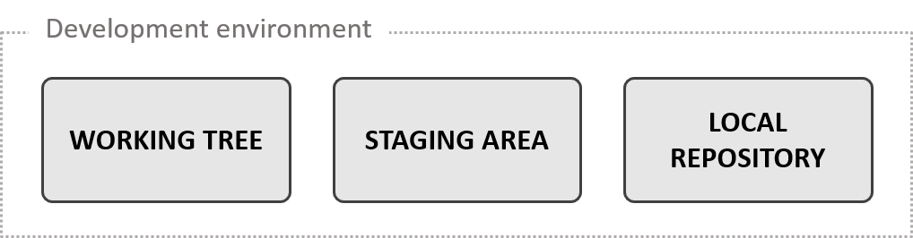
</p>

- El **local repository**, o simplemente repositorio, almacena metadatos y los estados de los archivos, actuando efectivamente como una base de datos para la gestión del proyecto. El repositorio también se conoce como *directorio de Git*, pues efectivamente se almacenan estos datos en un directorio; usualmente oculto, con el nombre `.git`.
- El **working tree** abarca todos los archivos contenidos en el directorio que contiene a `.git`; los subdirectorios también son considerados. Representa todos los posibles archivos que Git puede versionar. El contenido del working tree siempre es obvio, pues simplemente son los archivos que ve al abrir el explorador de archivos de su preferencia.
- El **staging area** define qué archivos y en qué estado serán persistidos para la siguiente versión del proyecto (siguiente commit). Físicamente, el staging area es el archivo `.git/index`. El staging area existe con la finalidad de proporcionar al desarrollador la flexibilidad de no tener que incluir en la siguiente versión del proyecto todos sus cambios, y en su lugar permitir elegir unos cuantos.

---

El flujo de trabajo usual con Git es como sigue:

1. El desarrollador modifica o crea archivos en el working tree.
2. Al estar satisfecho con las modificaciones, se añaden archivos selectos al staging area, definiendo así el contenido que esos archivos del proyecto tendrán en la siguiente versión.
3. Se realiza un commit, el cual toma lo añadido en el staging area y genera una versión actualizada del proyecto, la cual es mostrada en el working tree y almacenada en el repositorio local.

### Estados de los archivos

En particular, un archivo se considera **tracked** si existe una versión registrada de éste en el repositorio local, lo cual ocurre al añadirlo al staging area o al incorporarlo en un commit. Un archivo tracked podría ser marcado por Git como **modified** o **staged**. Si un archivo es añadido al staging area, entonces el archivo está staged. Si un archivo tracked ha sido modificado, pero no añadido al staging area, está modified. Los archivos que no han formado parte de algún commit y tampoco han sido añadidos al staging area se dice que están **untracked**. Todo archivo nuevo empieza con el status de untracked y Git no versiona estos archivos en ese estado.

Existen casos en los que es deseable dejar ciertos archivos permanentemente untracked. Para este caso Git ofrece el estado *ignored*, el cual es discutido en [Parte 2: Profundizando](Parte2_Profundizando.md).

## Comandos básicos para la gestión de un repositorio

> Para algunos de estos comandos se presentan también banderas u argumentos que me han resultado útiles, mas cabe mencionar que existen muchas más opciones. Git tiene integrado un sistema de ayuda; para cada comando se puede solicitar su documentación mediante las siguientes dos opciones de sintaxis.
>
>```bnf
> git <comando> --help  (1)
> git help <comando>    (2)
>```
>
> **La sintaxis mostrada a lo largo del manual es expresada en [EBNF](#cómo-leer-la-sintaxis-de-los-comandos) y simplificada (sólo muestro lo más útil y común). Vea la documentación oficial de cada comando para todas las banderas y opciones**.

Crear un repositorio local.

```bnf
git init
```

Muestra archivos modified y staged. Sólo cuando existen archivos en el staging area se puede realizar un commit. Para ver una versión resumida del estado, úsese la bandera `-s` o `--short`.

```bnf
git status [-s | --short]
```

Agrega uno o varios archivos al staging area. En ocasiones se modifican archivos que ya habían sido añadidos al staging area, para actualizar el index con los cambios del working tree utilizar la bandera `-u`, la cual no añade archivos nuevos. Si desea agregar todos los archivos nuevos, eliminados o modificados utilice la bandera `-A` o simplemente pase como valor de `<archivos>` un punto (`.`).

Al igual que el resto de los comandos de Git que seleccionan archivos, acepta [patrones glob](https://en.wikipedia.org/wiki/Glob_(programming)). Por ejemplo, si como valor de `<archivos>` se utiliza un punto (`.`), que denota el directorio actual, todos los archivos modificados y untracked se añaden al index. Al utilizar glob, es preferible siempre ponerlo entre comillas simples para evitar la expansión del shell.

```bnf
git add [-u | --update] [-A | --all] <archivos>
```

Realiza un commit. Para añadir un menaje breve de commit utilice la bandera `-m` seguido del mensaje entre comillas. En caso que se desee redactar el mensaje en el editor de texto especificado en `core.editor`, no incluya la bandera `-m`. Al terminar, guardar y cerrar el editor. La bandera `-a` incluye al staging area archivos modified (tracked modificados, no considera los untracked) e inicia el proceso de realizar un commit.

La forma de redacción del mensaje puede hacer de Git una herramienta mucho más o menos útil. Guía para redactar mensajes relevantes: <https://chris.beams.io/posts/git-commit/>. ¿Cuándo realizar un commit? <https://jasonmccreary.me/articles/when-to-make-git-commit/>.

```bnf
git commit [-a] [-m "<mensaje>"]
```

Recorre el árbol de commits desde la posición de `HEAD`. La bandera `--oneline` muestra una versión más compacta, sólo desplegando el encabezado del mensaje, los primeros 7 caracteres del hash del commit y la rama en la que fue realizado. Si se desean ver todos los commits del repositorio (esto es, todos los commits accesibles mediante alguna rama) en lugar a sólo los accesibles a través de `HEAD`, utilice la bandera `--all`.

Otras banderas menos utilizadas son `-<cantidad>`, que muestra sólo `<cantidad>` número de commits. Por ejemplo `-1` sólo muestra un commit. `--first-parent` recorre el árbol de commits sólo pasando por el primer padre. Esto es muy útil al revisar la historia de `master`, donde no se suele desear ver commits de ramas fusionadas. El argumento opcional `<commit>` permite especificar una posición distinta a `HEAD` para iniciar el recorrido del árbol. Este argumento toma cualquier referencia resoluble a un commit, véase [referencias absolutas](#referencias-absolutas) y [referencias relativas](#referencias-relativas).

```bnf
git log [--all] [--oneline] [-<cantidad>] [--first-parent] [<commit>]
```

Lista cronológica inversa (se muestra primero lo más reciente) de los objetos a los que `HEAD` ha apuntado. A diferencia del comando `git log`, `git reflog` puede mostrar commits que no son accesibles mediante una rama, pues muestra un historial en lugar de recorrer el árbol. Este comando es sumamente útil para recuperarse de errores al utilizar Git. Esto es abarcado en [Parte 2: Profundizando](Parte2_Profundizando.md). También véase: <https://stackoverflow.com/questions/17857723/whats-the-difference-between-git-reflog-and-log>.

```bnf
git reflog
```

## Correcciones básicas

Un error usual es olvidar añadir archivos a un commit o redactar mal el mensaje del commit. Si `--amend` se utiliza con el staging area vacío, entonces el editor de texto especificado en `core.editor` muestra el mensaje del commit pasado y permite modificarlo. Por otro lado, si el staging area contiene cambios, al commit pasado se le añaden estos cambios, al igual que resulta posible modificar el mensaje del commit. En caso que no se desee modificar el mensaje del commit, utilizar `--no-edit`. Aquí se muestra una sintaxis más completa del mismo comando `git commit`.

```bnf
git commit [--amend [--no-edit]] [-a] [-m "<mensaje>"]
```

Revertir las modificaciones de `<archivos>` (para seleccionar varios archivos, separar con un espacio los nombres) a la versión almacenada en el snapshot apuntado por el commit referido por `HEAD`. En otras palabras, deshace los cambios no committed de archivos selectos. En el extraño caso que el nombre de un archivo inicie con un guión alto (`-`), añada dos guiones altos antes (`--`) para que el shell lo trate como un archivo en lugar de una bandera. Ejemplo: `git checkout -- -foo.txt`.

```bnf
git checkout [--] <archivos>
```

Para retirar todos los archivos del staging area (pero preservar los cambios en el working tree) no especifique ningún archivo. Alternativamente, puede retirar sólo archivos específicos. En la [Parte 2: Profundizando](Parte2_Profundizando.md) se discute con detalle el comando `git reset`.

```bnf
git reset <archivos>
```

Retira archivos del repositorio, pero los mantiene en el working tree. Esto es muy útil cuando se desea ignorar (`.gitignore`) un archivo o directorio que tiene el estado tracked. Véase [Parte 2. Profundizando](Parte2_Profundizando.md).

```bnf
git rm --cached <archivo>
```

## Concepto de rama

> A branch in Git is simply a lightweight movable pointer to a commit object.
>
> Más información en <https://git-scm.com/book/en/v2/Git-Internals-Git-Objects>

Para poder tener un sólido entendimiento de las ramas de Git, es necesario explorar con más detalle el funcionamiento de bajo nivel de Git en cuanto a cómo almacena las distintas versiones de los archivos. Entendido esto, el concepto de rama es tan sólo una extensión del sistema. Esta sección acaso sea una de las más difíciles de entender, mas su compresión lo vale en absoluto.

---

### Objetos de Git

<p align="center">
  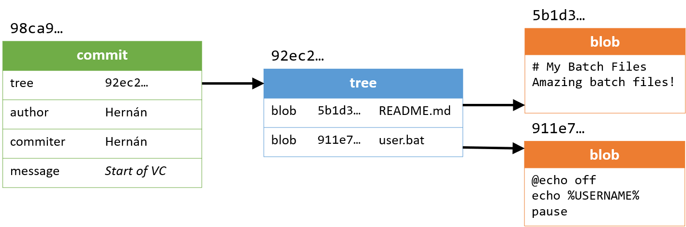
</p>

A lo largo de esta sección se denota a la carpeta `.git/objects` por el nombre *directorio objects*. Recuérdese que `.git` está oculto por defecto, pues sus contenidos no deben modificarse directamente, mas para fines de estudio puede resultar provechoso inspeccionar los archivos.

Imagínese el inicio de un repositorio simple en el que se guardarán archivos batch (`.bat`). Comencemos el análisis desde la ejecución del comando `git init`. Tras correr este comando, un nuevo repositorio es creado. Examinando el directorio objects, podemos comprobar que sólo las carpetas pack e info existen; para esta sección no resulta relevante conocer su propósito. Ahora, imaginemos que el desarrollador codifica su primer archivo batch: `user.bat`. Luego, redacta una breve descripción del repositorio: `README.md`. Hasta ahora, esos archivos sólo existen en el working tree (sistema de archivos del SO).

El desarrollador desea realizar un commit con su progreso. Para lograr esto, **añade ambos archivos al staging area**. Si en este momento se inspecciona objects, puede comprobarse que dos directorios han aparecido: 5b y 91 (los nombres de estos directorios concuerdan con la figura del inicio de esta sección, mas si usted realiza el experimento muy probablemente los nombres sean distintos, pero es seguro que serán dos directorios). ¿Qué significa esto? Significa que Git ha registrado el estado de los archivos `README.md` y `user.bat` en objetos blob.

**Ahora el desarrollador ejecuta el comando `git commit -m "Start of VC"`**, con lo cual se genera un objeto tree, el cual apunta a los blobs; y un objeto commit, el cual apunta al tree. Esto se ilustra en la figura del inicio de la sección presente. En este punto, si se revisa el directorio objects, dos carpetas más habrán aparecido; hasta ahora Git ha registrado cuatro objetos: dos blobs, un tree y un commit.

| Objeto | Función |
|:--------:|---------|
|blob    | Representa los contenidos de un archivo que no es directorio. |
|tree    | Permite registrar la estructura de directorios. Almacena los nombres de los archivos de un directorio, al igual que un apuntador al blob o tree correspondiente que guarda el contenido de los archivos. |
|commit  | Apunta a un tree que representa el staging area al momento de realizar el commit; almacena el nombre del autor, commiter, el mensaje del commit y sus commits padres. |

**Todos los objetos son identificados por Git mediante un hash SHA-1**. Aquí es importante recordar que SHA-1 produce códigos de 40 caracteres de longitud (SHA-1 produce valores hash de 160 bits, en hexadecimal). Entonces, los identificadores con puntos suspensivos sobre los objetos de la figura son hashes SHA-1, etiqueta que Git les asigna para poder identificarlos y referirse a ellos. A continuación, se presenta un término más del vocabulario de Git.

> **Snapshot**. Tree que representa el staging area asociado a un commit.

Ahora bien, continuemos el ejemplo. El programador continua trabajando en su repositorio, añadiendo más archivos batch y actualizando su `README.md` y acaso algunos archivos antiguos. También puede que elimine algunos scripts. Tras dos commits más, se tiene una jerarquía unidireccional de objetos commit, tree y blob, en la que cada commit apunta a su padre (y cada commit no conoce a sus descendientes). Esta jerarquía puede ser representada como una secuencia de commits que apuntan a sus snapshots correspondientes.

<p align="center">
  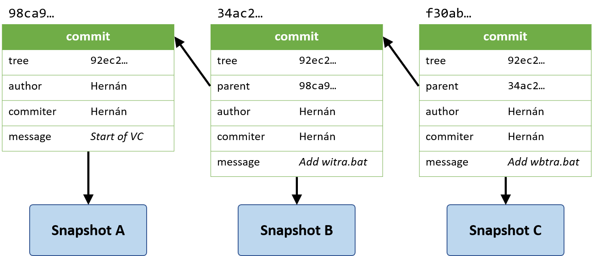
</p>

Entendido este sistema, podemos ahora comprender con formalidad qué es una rama en Git.

> **Rama**. Referencia a un objeto commit.

Al igual que todas las referencias en Git, esta referencia es un hash SHA-1 que identifica a un commit. Al crearse nuevos commits, la referencia avanza al último commit realizado, por lo que se dice que estas referencias pueden moverse (son movable). También son ligeras (lightweight) pues se requiere de poco más de 160 bits para ser almacenadas. **Los programadores suelen usar la palabra rama; Git se refiere a estos apuntadores con el término `head`**. Esto puede comprobarse al inspeccionar `.git/refs/heads`.

Por defecto, Git proporciona la rama `master` como inicial. Completando la figura anterior y omitiendo el contenido de los commits por brevedad, tenemos que la imagen completa de los objetos es la mostrada próximamente.

<p align="center">
  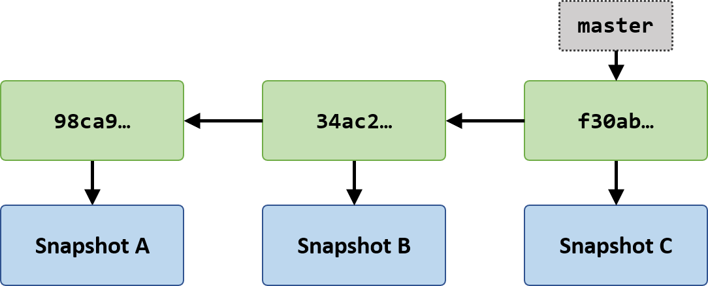
</p>

**Al crear una nueva rama, la nueva rama apunta al commit que es apuntado durante su creación**. Luego, en el ejemplo, si el desarrollador crea una rama `buf-fix`, ésta apunta al commit identificado por el hash SHA-1 iniciando con f30ab. Si el desarrollador se cambia a esta rama, arregla el bug, añade los archivos relevantes al staging area y realiza un commit, podemos notar algo muy interesante.

<p align="center">
  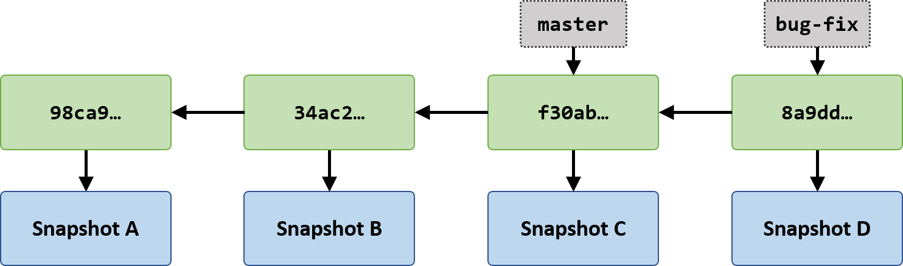
</p>

Podemos observar que la referencia (rama) `buf-fix` avanzó al último commit tras ser realizado, mas el commit al que `master` apunta no fue actualizado. Ahora cabe preguntar, ¿cómo Git sabe en qué rama un usuario está? La respuesta yace en otro apuntador, también de la forma de un hash SHA-1 al que Git denomina `HEAD` (almacenado en `.git/HEAD`). Completando la figura anterior, puede verse que Git conoce que el usuario está trabajando en la rama `buf-fix` pues `HEAD` apunta a `buf-fix`, que a su vez apunta al último commit realizado por el usuario.

<p align="center">
  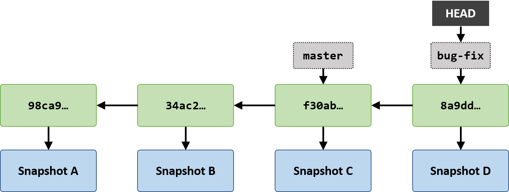
</p>

---

Las ramas son parte fundamental de Git. A diferencia de otros sistemas de control de versiones, como CVS, el proceso de creación de ramas en Git es rápido, pues implica tan sólo cambiar una referencia de 160 bits. **Las ramas son el mecanismo principal por el cual se organiza la colaboración**.

## Comandos básicos para ramas

Muestra todas las ramas del repositorio local si ninguna bandera es usada. Muestra todas las ramas del repositorio local y los remotos asociados al usar `-a`. La distinción entre ramas locales y remotas es examinada en otra sección del manual. La bandera `-vv` muestra una descripción completa por rama. La descripción por rama incluye su nombre, hash SHA-1 que las identifica, el encabezado del mensaje del commit al que apuntan y, en caso de existir, la [rama upstream](#configurar-upstreams) asociada.

```bnf
git branch [-a | --all] [-vv]
```

Crea una rama. Nótese que al crear una rama no se cambia automáticamente a la misma.

```bnf
git branch <rama>
```

Cambiar a una rama. Utilizar `-b` para crear la rama (si no existe ya) y cambiarse a ella.

```bnf
git checkout [-b] <rama>
```

## Fusión de ramas

> Resumen de <https://git-scm.com/book/en/v2/Git-Branching-Basic-Branching-and-Merging>

Si las ramas son el mecanismo principal por el cual se organiza la colaboración, debe existir una manera por la cual los cambios de cada rama se integren, obteniendo una versión unificada de todas las colaboraciones. A través de un ejemplo, veamos cómo la fusión de ramas ocurre. En esta sección se presentan los dos tipos de merge que existen en Git: (1) **fast-forward** y (2) **recursive**. En adición al merge existe el comando rebase para integrar cambios entre ramas, mas su uso es más avanzado y por lo tanto no es discutido en esta parte del manual. Vea [Parte 2: Profundizando](Parte2_Profundizando.md) para conocer acerca de `git rebase`.

Imagínese que Juan trabaja en un proyecto aún temprano en etapa de desarrollo; sólo se han realizado tres commits.

<p align="center">
  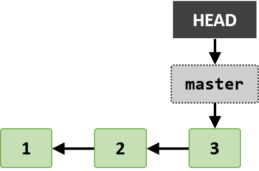
</p>

Ahora Juan decide dedicarse a implementar una característica nueva, para lo cual crea la rama `feature`, se cambia a ésta y comienza a trabajar. Realiza un commit.

<p align="center">
  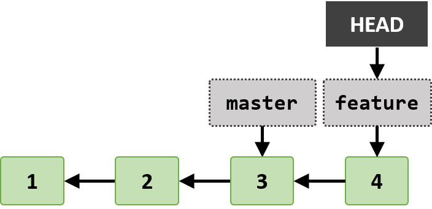
</p>

En este momento Juan es informado que existe un bug en `master` cuyo patch debe ser priorizado sobre la característica que está implementando. Para realizar la corrección del bug, Juan crea la nueva rama `bug-fix` a partir de `master`. Es decir, el desarrollador requirió ejecutar los siguientes comandos justo después de haber realizado su commit:

```shell
$ git checkout master
$ git branch bug-fix
$ git checkout bug-fix
```

En esta rama el desarrollador soluciona el bug con un único commit. Nótese que el progreso que Juan llevaba en la rama `feature` no existe en la rama `master`, pues se encuentra atrás en la historia. **Generalizando, al cambiar de rama, el working tree muestra los contenidos del snapshot del commit de la rama**. Ahora la relación de los commits luce como lo indica la figura siguiente.

<p align="center">
  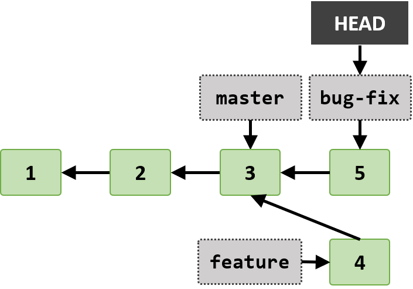
</p>

### Fast-forward merge

Juan ahora debe integrar su solución del bug a `master`. Es decir, `bug-fix` debe ser fusionada en `master`. Para incorporar los cambios de `bug-fix` a `master`, Juan usa los siguientes comandos:

```shell
$ git checkout master
$ git merge bug-fix
Updating f42c576..3a0874c
Fast-forward
 App.java | 1 -
 1 file changed, 1 deletion(-)
```

La estrategia utilizada para el merge es fast-forward pues basta con adelantar la referencia `master` al commit 5 para incorporar los cambios de la rama `bug-fix`. Se elimina la rama `bug-fix` utilizando el comando `git branch -d bug-fix` pues no se necesita más y ahora las ramas y commits tienen la siguiente estructura y estado.

<p align="center">
  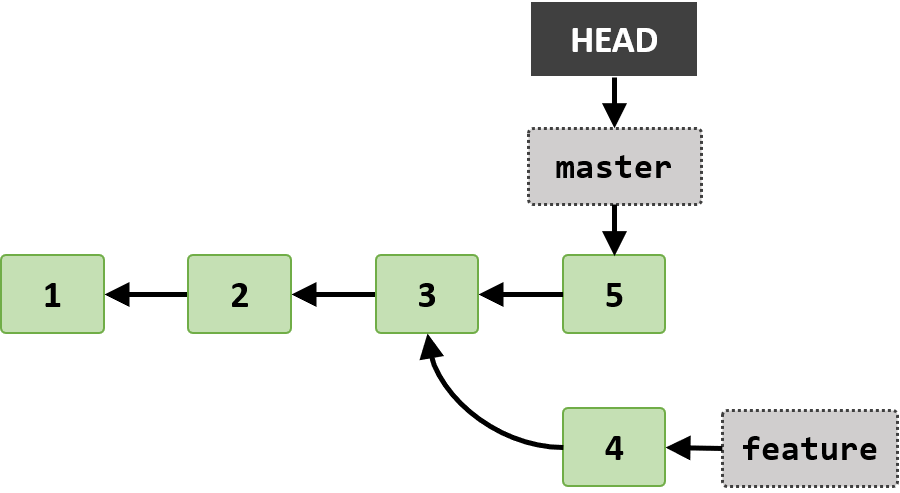
</p>

Juan ya puede continuar trabajando en la característica que estaba implementando en `feature`, para lo cual se cambia a esta rama y logra terminar la implementación en un commit más, como se muestra a continuación.

<p align="center">
  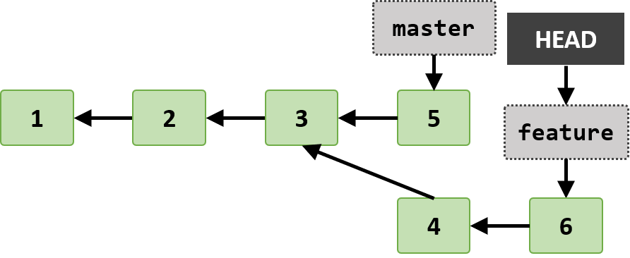
</p>

### Recursive merge

Puesto que la implementación de la nueva característica está terminada, Juan desea incorporar los cambios de `feature` en `master`. Puede notarse que el commit 6 no es descendiente directo del commit 5, por lo que un merge fast-forward no es posible. En estos casos Git utiliza la estrategia recursiva. Al fusionar `feature` en `master` con los siguientes comandos vemos el siguiente mensaje:

```shell
$ git checkout master
$ git merge feature
Merge made by the 'recursive' strategy.
 Reader.java | 3 +++
 1 file changed, 3 insertions(+)
 create mode 100644 Reader.java
```

En este caso, Git utiliza tres snapshots para realizar la fusión de contenidos y **genera un nuevo commit** (asociado a un nuevo snapshot) que representa la fusión de las dos ramas. Los tres snapshots pertenecen a los dos últimos commits de las ramas `master` y `feature` y el tercero, al ancestro común, que en este caso es el commit 3. Los commits y sus relaciones están mostrados por la siguiente figura.

<p align="center">
  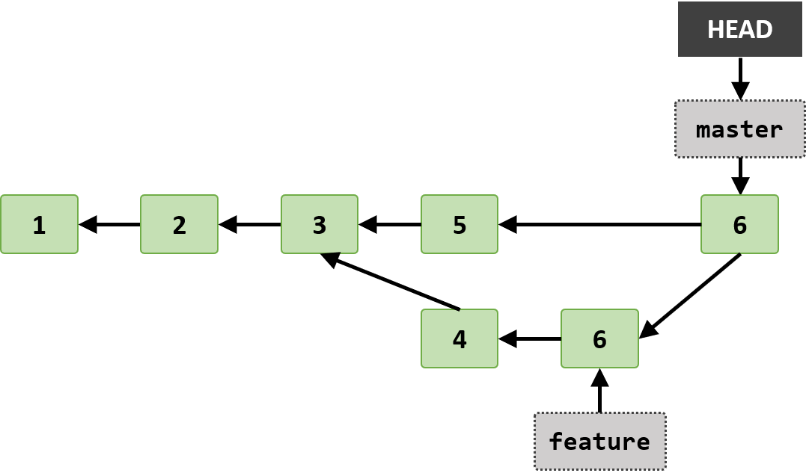
</p>

### Comandos básicos para merges

Si `HEAD` apunta a la rama A, incorpora los cambios de la rama B en la rama A (la estrategia del merge es seleccionada por Git). En algunos workflows podría ser deseable siempre crear un commit de merge, para estos casos se evita la estrategia fast-forward (y elige explícitamente la estrategia recursiva) utilizando `--no-ff`.

```bnf
git merge [--no-ff] B
```

Usar `d` para elimina la rama especificada si todos los cambios de la rama son accesibles por `HEAD` o por algún ancestro de la rama. Simplemente, si la rama ha sido fusionada con una no derivada de ella, entonces este comando puede utilizarse efectivamente. Usar `-D` para forzosamente borra la rama seleccionada, incluso si tiene cambios no fusionados.

```bnf
git branch (-d | -D) <rama>
```

## Navegando entre commits

> Véase <https://git-scm.com/book/en/v2/Git-Tools-Revision-Selection>

En ocasiones resulta necesario revisar versiones anteriores del proyecto, ya sea por estar en busca de un bug (commit que introduce una regresión), requerir demostrar la evolución de un módulo o al necesitar revertir las modificaciones introducidas por algunos commits. Para lograr cualquiera de estas tareas es importante conocer cómo navegar el árbol de commits. Con el fin de demostrar la navegación se toma como árbol de referencia el mostrado en la figura inferior.

<p align="center">
  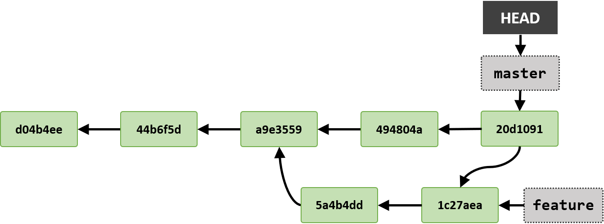
</p>

Existen dos formas de navegación: por referencia **absoluta** o **relativa**. Recuerde de la sección [Objetos de Git](#objetos-de-git) que las versiones del proyecto son almacenadas en los snapshots asociados a cada objeto commit. Recorrer la historia del proyecto significa visitar commits pasados. También sabemos que una rama no es más que una referencia a un commit, por lo que la resolución de la rama (identificar el commit al que apunta), también representa una versión del proyecto. De forma similar, `HEAD` es una referencia que indica a Git la posición actual del usuario en el árbol de commits, apuntando siempre a un commit u objeto que pueda resolverse en un commit, como una rama.

De este análisis encontramos que existen tres tipos de referencias que directamente o en su resolución apuntan al mismo tipo de objeto: un commit.

> **Referencias relacionadas con commits: (1) commits, (2) ramas, (3) `HEAD`.**

Existen otras referencias que también son o apuntan a commits, como los stashes discutidos en [Parte 2: Profundizando](Parte2_Profundizando.md) o los tags, pero esta sección se enfoca en las tres mencionadas.

En [Comandos básicos para ramas](#comandos-básicos-para-ramas) se introdujo el comando `git checkout`, el cual permite cambiar la rama a la que apunta `HEAD`. Con cada nuevo commit realizado en tal rama, `HEAD` avanza acordemente. Aquí presento una forma más general de este comando, donde el argumento no tiene que ser una rama, pero cualquier referencia que sea o pueda resolverse en un commit, como una rama, `HEAD`, un commit, un tag o un stash.

```bnf
git checkout <referencia-resoluble-a-un-commit>
```

### Referencias absolutas

Como se explica en [Objetos de Git](#objetos-de-git), el estándar para identificadores de objetos es SHA-1. Como argumento de `git checkout` es legal pasar un hash de este tipo o el nombre de una rama. Podemos hallar una versión corta, de 7 caracteres, del SHA-1 que identifica a un commit utilizando el comando `git log --oneline`. Para visualizar el árbol desde la terminal, puede utilizar la bandera adicional `--graph`.

```bash
# Para recorrer todo el árbol de commits sin importar la posición de
# `HEAD` utilice también la bandera `--all`.
$ git log --oneline --graph
*   20d1091 (HEAD -> master) Merge branch 'feature'
|\
| * 1c27aea (feature) Add more content to f1
| * 5a4b4dd Add content to f2
* | 494804a Create f3
|/
* a9e3559 Create f2
* 44b6f5d Modify f1
* d04b4ee Start version control
```

Ahora si quisiéramos navegar al commit con el mensaje *Add more content to f1*, tenemos la opción de utilizar `git checkout feature` o `git checkout 1c27aea`. Veamos ambas formas.

---

```shell
$ git checkout feature
Switched to branch 'feature'
```

<p align="center">
  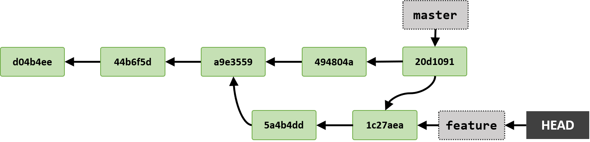
</p>

---

Por otro lado, si especificamos el hash en lugar del nombre de la rama podemos notar que el working treese actualiza con los contenidos del snapshot del mismo commit, pero el comando reporta algo muy distinto en la terminal.

---

```shell
$ git checkout 1c27aea
Note: checking out '1c27aea'.

You are in 'detached HEAD' state. You can look around, make experimental
changes and commit them, and you can discard any commits you make in this
state without impacting any branches by performing another checkout.

If you want to create a new branch to retain commits you create, you may
do so (now or later) by using -b with the checkout command again. Example:

  git checkout -b <new-branch-name>

HEAD is now at 1c27aea Add more content to f1
```

<p align="center">
  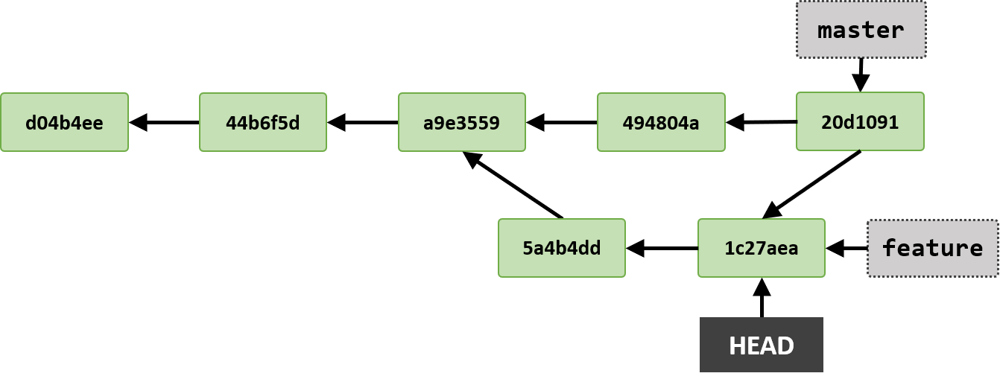
</p>

---

La primera vez que vi el mensaje **detached `HEAD` state** me confundí mucho, pero no es algo  de que alarmarse e incluso es sencillo entender la razón del mensaje. Hasta ahora, el apuntador `HEAD` siempre se ha visto en la siguiente posición: `HEAD -> <rama> -> <commit>`. Durante desarrollo siempre se tiene `HEAD` apuntando a una rama y nunca directamente a un commit.

> **Se dice que `HEAD` está detached si apunta directamente a un commit. Se dice que `HEAD`está attached si apunta a una rama.**

El mensaje aparece pues indica que todo commit realizado en la posición actual de `HEAD` será perdido cuando `HEAD` apunte a otro commit. Veamos un ejemplo.

<p align="center">
  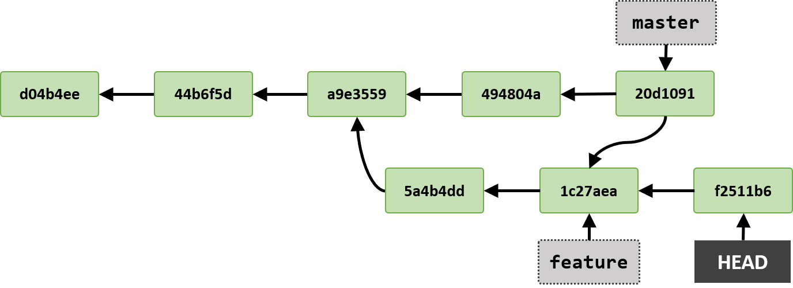
</p>

En la posición de detached `HEAD`, creé un archivo, lo agregué al staging area y realicé un commit. Al igual que en el caso cuando `HEAD` apunta a una rama, el apuntador se mueve junto con el nuevo commit. Sin embargo, ahora consideremos qué ocurre si se ejecuta `git checkout master`. O en general, si se hace checkout a cualquier otro commit.

```shell
$ git checkout master
Warning: you are leaving 1 commit behind, not connected to
any of your branches:

  f2511b6 Create file-to-lose

If you want to keep it by creating a new branch, this may be a good time
to do so with:

 git branch <new-branch-name> f2511b6

Switched to branch 'master'
```

<p align="center">
  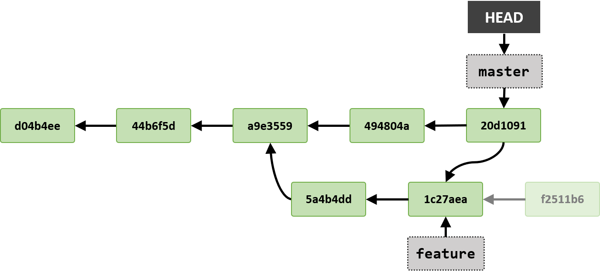
</p>

Podemos ver que ahora no es posible llegar al commit `f2511b6` mediante alguna rama.

```shell
$ git log --all --oneline
20d1091 (HEAD -> master) Merge branch 'feature'
1c27aea (feature) Add more content to f1
494804a Create f3
5a4b4dd Add content to f2
a9e3559 Create f2
44b6f5d Modify f1
d04b4ee Start version control
```

La forma de Git de advertir de esta perdida es avisando del estado detached. Note que el commit no fue eliminado, simplemente no es accesible mediante ningún recorrido de los `head`(ramas). Pude utilizar `git reflog` para hallar el hash y regresar al mismo.

🔍 **Tip**. Si recuerda incluso parte del mensaje del commit y utiliza Bash como su shell, puede pasar lo que recuerda del nombre a `grep` ([documentación de `grep` en Bash](https://ss64.com/bash/grep.html)). Por ejemplo, recuerdo que la cadena "lose" se halla en el mensaje, entonces puede realizar lo siguiente para regresar al commit.

```bash
# La bandera `-i` de grep indica ignorar la capitalización.
$ git reflog | grep -i "lose"
f2511b6 HEAD@{7}: commit: Create file-to-lose

$ git checkout f2511b6
Note: checking out 'f2511b6'.

You are in 'detached HEAD' state. You can look around, make experimental
changes and commit them, and you can discard any commits you make in this
state without impacting any branches by performing another checkout.

If you want to create a new branch to retain commits you create, you may
do so (now or later) by using -b with the checkout command again. Example:

  git checkout -b <new-branch-name>

HEAD is now at f2511b6 Create file-to-lose
```

### Referencias relativas

Recordemos el estado inicial del árbol de commits. La dirección de las flechas de commit a commit es muy importante: **cada commit sólo conoce a sus padres; a sus hijos no**. De esta observación adquiere sentido que existen marcadores de ascendencia (`~`, `^`), pero no de descendencia. Es decir, la navegación relativa se refiere a recorrer la *ascendencia* de un commit.

<p align="center">
  
</p>

Individualmente, tanto el marcador `~` como el `^` se refieren al primer padre del commit especificado; no hay diferencia. En los snippets utilizo `-c advice.detachedHead=false` para evitar la extensa advertencia del estado detached de `HEAD`. Puede utilizar `-c` para asignar variables de configuración sólo para ese comando.

```shell
$ git -c advice.detachedHead=false checkout HEAD~
HEAD is now at 494804a Create f3
```

```shell
$ git -c advice.detachedHead=false checkout HEAD^
HEAD is now at 494804a Create f3
```

La distinción entre `~` y `^` se vuelve aparente al ser utilizados con números. `~1` denota al primer padre; `~2` denota al primer padre del primer padre del commit, etc. Por otro lado, `^1` también denota al primer padre, pero `^2` denota al segundo padre del commit (esto sólo tiene sentido en el contexto de un merge recursivo, cuando un commit tiene más de un padre).

| Marcador de ascendencia | Ejemplos |
|:---:|---|
| `~n` | `HEAD~2 -> a9e3559`<br>`HEAD~3 -> 44b6f5d` |
| `^n` | `HEAD^2 -> 1c27aea`<br>`HEAD^3 -> error: pathspec 'HEAD^3' did not match any file(s) known to git.` |

Estos marcadores también pueden combinarse y tener como objeto una rama o incluso otro commit.

| Ejemplos |
|---|
| `5a4b4dd` **`<-`** `HEAD^2~` ó `feature~` ó `1c27aea^` |
| `a9e3559` **`<-`** `master^^` ó `master~~` ó `494804a~` |

En ocasiones también encontrará referencias del formato `HEAD@{n}`, donde `n` es un número entero. Éstas son referencias a las entradas de `git reflog`.

## Conflictos al realizar un merge

En ocasiones, las modificaciones de dos ramas distintas alteran algunas líneas en común de los mismos archivos. En estos casos Git no puede ejecutar un merge de forma automática; la intervención del programador es necesaria. Del ejemplo anterior, imaginemos que la característica agregada en `feature` alteró `App.java`, archivo que también fue modificado por la rama `bug-fix` y cuyos cambios ya se encuentran fusionados en `master`. En particular, del ejemplo anterior, nos ubicamos en este momento.

<p align="center">
  
</p>

Al intentar fusionar `feature` en `master`, ocurrirá un conflicto sobre el archivo `App.java`, pues tanto el commit 6 (perteneciente a `feature`) como el 5 (perteneciente a `master`) tienen cambios en las mismas líneas de este archivo.

```shell
$ git checkout master
$ git merge feature
Auto-merging App.java
CONFLICT (content): Merge conflict in App.java
Automatic merge failed; fix conflicts and then commit the result.
```

Al ocurrir esto, el proceso de merge es pausado y Git espera que el desarrollador resuelva los conflictos antes de proseguir con el merge. En cualquier momento durante esta pausa, utilizar el comando `git status` informa cuáles archivos no han podido ser fusionados dado uno o más conflictos.

```shell
$ git status
On branch master
You have unmerged paths.
  (fix conflicts and run "git commit")
  (use "git merge --abort" to abort the merge)

Unmerged paths:
  (use "git add <file>..." to mark resolution)

        both modified:   App.java

no changes added to commit (use "git add" and/or "git commit -a")
```

Para resolver el conflicto, basta con abrir el archivo utilizando cualquier editor de texto y seleccionar las modificaciones de la rama deseada. En las capturas de pantalla inferiores se muestra `App.java` abierto en Vim (izquierda) y VSCode (derecha). Nótese la conveniente integración de VSCode con Git, que despliega opciones en la parte superior del conflicto para una rápida resolución. Otros muchos editores de texto e IDEs también cuentan con estas facilidades.

<p align="center">
  
</p>

Aquí puede verse la estructura por la cual Git informa de un conflicto, que se conforma por los siguientes marcadores.

```shell
<<<<<<< HEAD
<cambios de la rama actual>
=======
<cambios de la rama especificada>
>>>>>>> <rama especificada>
```

Tras eliminar los marcadores de conflicto (mediante las facilidades de un editor de texto o IDE o simplemente eliminando los caracteres) y seleccionar los cambios deseados, añada el archivo al staging area para señalar que el conflicto ha sido resuelto. Si se corre git status en este momento Git reporta lo siguiente.

```shell
$ git status
On branch master
All conflicts fixed but you are still merging.
  (use "git commit" to conclude merge)
```

Ahora sólo resta realizar un commit que representará el commit de merge que, como se ha estudiado, cuando no existe un conflicto y la estrategia de merge es recursivo, Git lo crea automáticamente. En este caso, lo realiza el programador. Ejecutar `git commit` o `git commit --continue` tienen el mismo resultado.

## Repositorios remotos

> Resumen de <https://git-scm.com/book/en/v2/Git-Basics-Working-with-Remotes>

Hasta ahora, todos los ejemplos y explicaciones han estado limitados a repositorios locales. Es decir, el directorio `.git` únicamente existe en la máquina del desarrollador. Una de las más grandes ventajas de un VCS es la facilidad para orquestar colaboraciones. **Para poder colaborar sobre un proyecto gestionado por Git es necesario administrar repositorios remotos**. A pesar que no existe definición formal de repositorio remoto, aquí menciono mi entendimiento del concepto.

> **Repositorio remoto**. Sea R un repositorio, cualquier otro repositorio (`.git`) que represente el mismo proyecto que R y sea accesible por R (ya sea mediante una red o acceso a memoria local) se considera remoto a R.

Nótese que el término *repositorio remoto* es popularmente asociado con repositorios almacenados en GitHub, GitLab u otro servicio de cloud storage para repositorios de Git. Sin embargo, el repo remoto puede incluso residir en el mismo host, aunque esto es muy raro en la práctica. El servicio de cloud storage más popular para repositorios de Git es GitHub.

<p align="center">
  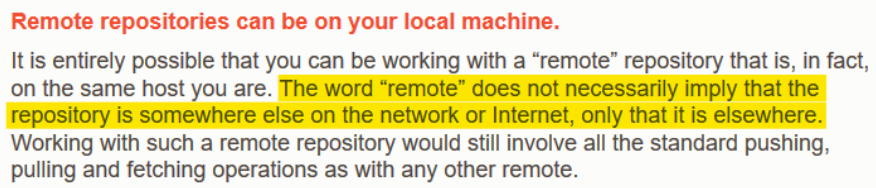
</p>

### Acceso a repositorios remotos

Para crear un repositorio local que represente el mismo proyecto que un repositorio remoto se utiliza el comando `git clone` que efectivamente clona el `.git` de la fuente especificada.

```bnf
git clone <dirección-repo-Git>
```

En GitHub existen muchos repositorios, todos los cuales pueden ser clonados. Un ejemplo de dirección legal para el comando es <https://github.com/HerCerM/BatchScripts>.

```shell
$ git clone https://github.com/HerCerM/BatchScripts
Cloning into 'BatchScripts'...
remote: Enumerating objects: 81, done.
remote: Counting objects: 100% (81/81), done.
remote: Compressing objects: 100% (59/59), done.
remote: Total 81 (delta 31), reused 57 (delta 18), pack-reused 0
Unpacking objects: 100% (81/81), done.
```

Tras ejecutar el comando un directorio con el nombre del repositorio (en este caso *BatchScripts*) aparece en el directorio en el que ejecutamos el comando. En esta carpeta se encuentra el `.git` que contiene la historia completa del proyecto.

Iniciar un repositorio utilizando `git clone` en lugar de `git init` tiene una consecuencia interesante. Al realizar `git clone`, ahora existen al menos dos repositorios que representan el mismo proyecto. Por lo tanto, ahora puede hablarse de repositorios remotos. Al clonar un repositorio, Git almacena información de la fuente (en `.git\logs\refs\remotes`) permitiendo establecer ya sea una relación de sólo lectura o lectura/escritura respecto a la fuente.

Listar aliases de repositorios remotos. Los aliases abrevian la dirección de un repositorio remoto, el cual puede ser un URL o dirección del sistema de archivos local. Para ver la dirección asociada a cada alias, utilizar la bandera `-v` o `--verbose`.

```bnf
git remote [-v | --verbose]
```

Por defecto, el alias creado al clonar un repositorio es `origin`. Por cada alias, dos direcciones son mostradas, una de lectura (fetch) y otra de escritura (push). **Para todo repositorio remoto se tiene acceso al menos de lectura (es posible que privilegios de escritura estén deshabilitados para ciertos usuario. Por ejemplo, si clona un repositorio de GitHub que no sea de usted y no está registrado como colaborador, sólo tendrá permisos de lectura - fetch)**.

```shell
$ git remote
origin

$ git remote -v
origin  https://github.com/HerCerM/BatchScripts (fetch)
origin  https://github.com/HerCerM/BatchScripts (push)
```

Es posible añadir (1), renombrar (2) y eliminar (3) aliases de repositorios remotos de forma manual.

```bnf
git remote add <alias> <dirección-repo-Git>      (1)
git remote rename <alias-antiguo> <alias-nuevo>  (2)
git remote remove <alias>                        (3)
```

---

Utilizando el comando para añadir (`git remote add`) podemos ver una forma alterna equivalente al ejemplo del comando `git clone`.

```shell
$ mkdir BatchScripts && cd BatchScripts
$ git init
Initialized empty Git repository in C:/Users/hjcer/Documents/temp/BatchScripts/.git/
$ git remote add origin https://github.com/HerCerM/BatchScripts
$ git pull origin master
remote: Enumerating objects: 81, done.
remote: Counting objects: 100% (81/81), done.
remote: Compressing objects: 100% (59/59), done.
remote: Total 81 (delta 31), reused 57 (delta 18), pack-reused 0
Unpacking objects: 100% (81/81), done.
From https://github.com/HerCerM/BatchScripts
 * branch            master     -> FETCH_HEAD
 * [new branch]      master     -> origin/master
```

---

### Operaciones de lectura y escritura (fetch, pull y push)

Omitir `<rama>` para obtener todos los cambios del remoto identificado por `<alias>` no existentes en el repo local. También pueden solicitarse sólo los cambios de una rama.

```bnf
git fetch <alias> [<rama>]
```

Es importante destacar que este comando solamente trae los cambios, mas no los integra a las ramas respectivas mediante un merge. Entonces, para incorporar las modificaciones hace falta un merge manual. Podemos ver que los cambios han sido traídos (almacenados en la rama `origin/master`), pero no incorporados a `master`.

```shell
$ git fetch origin
$ git branch -a
* master
  remotes/origin/master
```

En la práctica, la mayoría de las veces se desea realizar un merge inmediatamente después de un fetch. `git pull` es un comando pensado para esto. **Es decir, `git pull` ejecuta dos comandos: primero un `git fetch`, seguido de `git merge`**.

```bnf
git pull [<alias> <rama>]
```

Observación acerca de la distinción entre `git fetch` y `git pull`.

<p align="center">
  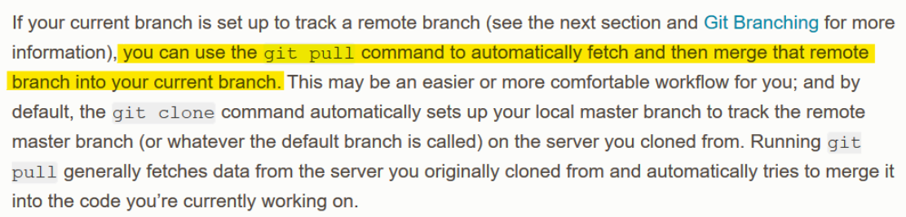
</p>

Actualizar la rama `<rama>` del repositorio remoto ubicado en `<alias>` con los cambios de la rama actual.

```bnf
git push [<alias> <rama>]
```

### Obtener información detallada de un repositorio remoto

Inspecciona el repositorio remoto bajo el alias `<alias>` y muestra información de relación respecto al repo local: ramas en el remoto que existen en el local (al igual que las que aún no han sido recuperadas) y la configuración de push y pull predeterminada por rama.

```bnf
git remote show <alias>
```

Continuando con el ejemplo del repositorio de scripts de Batch (iniciado por `git clone` en lugar de la forma alterna mostrada), el comando anteriormente mencionado muestra lo siguiente.

```shell
$ git remote show origin
* remote origin
  Fetch URL: https://github.com/HerCerM/BatchScripts
  Push  URL: https://github.com/HerCerM/BatchScripts
  HEAD branch: master
  Remote branch:
    master tracked
  Local branch configured for 'git pull':
    master merges with remote master
  Local ref configured for 'git push':
    master pushes to master (up to date)
```

Podemos ver que en el repositorio remoto sólo existe una rama: `master`. En adición, vemos que en el repo local tenemos la versión de `master` (tracked). También vemos la configuración predeterminada para push y pull ubicándonos en la rama `master`. Desde esa rama, basta con realizar `git pull` o `git push` y Git resuelve el alias y la rama.

```shell
$ git pull
Already up to date.

$ git push
Everything up-to-date
```

### Configurar upstreams

Retomemos el ejemplo en el que se inicia el repositorio de scripts de Batch mediante la forma alterna a `git clone` (es decir, mediante `git init` seguido de `git remote add`). En este caso, veamos qué ocurre al intentar hacer pull o push sin especificar ni el alias ni la rama.

```shell
$ git pull
There is no tracking information for the current branch.
Please specify which branch you want to merge with.
See git-pull(1) for details.

    git pull <remote> <branch>

If you wish to set tracking information for this branch you can do so with:

    git branch --set-upstream-to=origin/<branch> master

$ git push
fatal: The current branch master has no upstream branch.
To push the current branch and set the remote as upstream, use

    git push --set-upstream origin master
```

En ambos casos la operación no se realiza con éxito, reportando Git que no hay información de tracking para la rama actual (en este caso, para `master`) o, en otras palabras como lo reporta el error de `git push`, que la rama `master` no tiene una rama upstream. Para resolver este problema de configuración es necesario asignar una rama upstream a `master`.

> **Rama upstream**. Rama de un repositorio remoto que es objeto de operaciones de lectura/escritura (fetch, pull y push) respecto a una rama en el repositorio local.

Es decir, cuando se realiza por ejemplo, `git pull origin master` ubicándose en la rama `master` del repo local, se dice que la rama `master` del repositorio ubicado en `origin` es upstream de la rama `master` del repositorio local para esa operación de pull.

```shell
$ git pull origin master
 From https://github.com/HerCerM/BatchScripts
 * branch            master     -> FETCH_HEAD
Already up to date.
```

Continuando con el ejemplo en mano, pudimos verificar que `git pull` arroja un error, pero eso no sucede con `git pull origin master` (tampoco ocurriría el error con `git push origin master`). En el último comando, se establece de forma explícita la rama upstream de esa operación pull respecto a `master` (el comando es ejecutado ubicado en `master` del repositorio local).  **Sería ideal poder configurar la rama `master` de `origin` como el objeto de todas las operaciones de lectura/escritura respecto a `master` local**.

La configuración puede realizarse de dos formas. Sin realizar una operación de lectura/escritura (1) o bien al realizar un push (2). Tras ejecutar alguno de estos comandos, simplemente ejecutar `git pull` o `git push` ubicándose en la rama configurada basta para obtener el comportamiento deseado de Git.

```bnf
git branch -u <alias>/<rama-remota> <rama-local>  (1)
git push -u <alias> <rama>                        (2)
```

Los upstreams configurados pueden mostrarse utilizando `git branch -vv`.

```bash
$ git branch -vv # Antes
* master e1d8495 Update README.md

$ git branch -u origin/master master
Branch 'master' set up to track remote branch 'master' from 'origin'.

$ git branch -vv # Después
* master e1d8495 [origin/master] Update README.md
```

Nótese el formato de la rama upstream configurada: `<alias>/<rama>`. Tras realizar al menos un fetch a esta rama, encontramos que `<alias>/<rama>` no sólo es notación para identificar la rama upstream, ¡sino también es una rama en el repositorio local!

```shell
$ git branch -a
* master
  remotes/origin/master
```

Recordemos el comando `git fetch`. Al ejecutar un fetch, los cambios no son integrados a alguna rama local, sino que sólo son traídos al repo local para inspección y, si se desea, para integración mediante `git merge`. ¿En dónde son esos cambios almacenados para inspección? Los cambios son almacenados en una rama de nombre `<alias>/<rama>` que sirve como rama de enlace entre una local y su upstream asociada (conocida en inglés como tracking branch). Entonces, en el proceso de enlace entre una rama local y una remota intervienen tres ramas: la rama local, la rama remota y una intermediara local que permite traer cambios del repo remoto sin inmediatamente agregarlos al repositorio local.

<p align="center">
  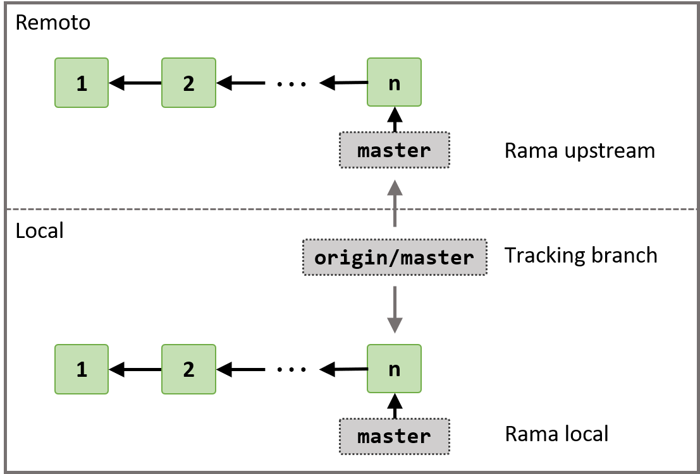
</p>
