# Profundizando

[👈 Parte 1: Fundamentos](Parte1_Fundamentos.md)

<!-- TOC -->

- [Flujos de trabajo (workflows)](#flujos-de-trabajo-workflows)
  - [¿Qué es un flujo de trabajo?](#¿qué-es-un-flujo-de-trabajo)
  - [¿Cómo elegir un flujo de trabajo?](#¿cómo-elegir-un-flujo-de-trabajo)
  - [Un buen punto de partida: GitHub Flow](#un-buen-punto-de-partida-github-flow)
  - [Conociendo más flujos de trabajo](#conociendo-más-flujos-de-trabajo)
- [Stashing para evitar commits parciales](#stashing-para-evitar-commits-parciales)
  - [¿Qué es un stash?](#¿qué-es-un-stash)
  - [Comandos para administrar stashes](#comandos-para-administrar-stashes)
  - [¿Cuándo puede cambiarse de rama sin hacer commit o stash de las modificaciones?](#¿cuándo-puede-cambiarse-de-rama-sin-hacer-commit-o-stash-de-las-modificaciones)
- [Eliminar archivos untracked](#eliminar-archivos-untracked)
- [Ignorar archivos (.gitignore)](#ignorar-archivos-gitignore)
  - [Expresiones glob vs regulares](#expresiones-glob-vs-regulares)
  - [Notación de expresiones glob](#notación-de-expresiones-glob)
  - [.gitignore](#gitignore)
  - [Ignorar archivos tracked](#ignorar-archivos-tracked)
- [El confuso archivo `.gitkeep` y los directorios vacíos](#el-confuso-archivo-gitkeep-y-los-directorios-vacíos)
- [Reescribiendo la historia](#reescribiendo-la-historia)
  - [¿Qué es *reescribir la historia*?](#¿qué-es-reescribir-la-historia)
  - [¿Qué es la *historia pública*?](#¿qué-es-la-historia-pública)
  - [¿Cómo se corrigen commits públicos?](#¿cómo-se-corrigen-commits-públicos)
- [Correcciones avanzadas](#correcciones-avanzadas)
  - [Cherry pick](#cherry-pick)
    - [Uso del comando](#uso-del-comando)
    - [Crítica de cherry pick](#crítica-de-cherry-pick)
  - [Reset](#reset)
    - [Uso del comando](#uso-del-comando-1)
    - [Recuperación de un `git reset --hard` equivocado](#recuperación-de-un-git-reset---hard-equivocado)
  - [Revert](#revert)
    - [¿Cuándo utilizar `git revert` sobre `git reset`?](#¿cuándo-utilizar-git-revert-sobre-git-reset)
    - [Uso del comando](#uso-del-comando-2)
  - [Rebase](#rebase)
    - [Rebase interactivo](#rebase-interactivo)
    - [Rebase no interactivo simple](#rebase-no-interactivo-simple)
    - [Rebase no interactivo con `--onto`](#rebase-no-interactivo-con---onto)
- [Examinando el staging area, working tree y repositorio](#examinando-el-staging-area-working-tree-y-repositorio)
  - [Inspección del staging area y working tree](#inspección-del-staging-area-y-working-tree)
  - [Inspección del repositorio](#inspección-del-repositorio)

<!-- /TOC -->

<a id="markdown-flujos-de-trabajo-workflows" name="flujos-de-trabajo-workflows"></a>
## Flujos de trabajo (workflows)

Utilizar Git eficientemente demanda más que únicamente conocer sus conceptos y los comandos que los implementan. Saber no sólo qué es una rama, pero cuándo y para qué crearlas, o cuándo realizar [rebases](#rebase) o preferir merges recursivos sobre fast-forward, etc. son asuntos que van más allá del conocimiento técnico de la herramienta, adentrándose en una línea de pensamiento más organizacional que tecnológica.

Al inicio de [Parte 1: Fundamentos](Parte1_Fundamentos.md), se habla de las ventajas de no sólo usar Git *per se*, pero cualquier sistema de control de versiones. El objetivo de estas herramientas es acelerar el desarrollo de software facilitando la colaboración, al hacer el proceso de integración simple, mientras un historial del proyecto que efectivamente funciona como respaldo es construido por la misma herramienta. Los VCSs (*version control systems*) facilitan la colaboración, aceleran el desarrollo de software y generan respaldos del proyecto. Git es muy flexible en tanto que no impone ningún flujo de trabajo específico, en su lugar sólo proporciona herramientas. Elegir conscientemente cómo usar Git puede hacer de este programa mucho más o menos útil en conseguir su propósito.

<a id="markdown-¿qué-es-un-flujo-de-trabajo" name="¿qué-es-un-flujo-de-trabajo"></a>
### ¿Qué es un flujo de trabajo?

<table>
  <tr>
    <td>
    Un flujo de trabajo define cómo un proyecto evoluciona, especificando el flujo o proceso iterativo mediante el cual se generan modificaciones sobre un proyecto, se revisan las modificaciones y se integran a una versión unificada.
    </td>
  </tr>
</table>

Este flujo podría utilizar muchas o pocas ramas; las ramas podrían extenderse decenas de commits antes de ser fusionadas en la versión unificada o ser fusionadas constantemente. Podría existir una nomenclatura para las ramas, podría en su lugar no usarse ramas del todo y sólo codificar en `master`. El acuerdo sobre estas decisiones conforman un flujo de trabajo.

<a id="markdown-¿cómo-elegir-un-flujo-de-trabajo" name="¿cómo-elegir-un-flujo-de-trabajo"></a>
### ¿Cómo elegir un flujo de trabajo?

No existe *el* workflow correcto y único a seguir, cada equipo debe considerar sus integrantes, estrategia de despliegue (*deployment*) y necesidades con el fin de elegir el flujo de trabajo que más los agilice, implicando la menor carga mental innecesaria posible. El hecho que no exista *el* workflow ideal, no significa que no existan flujos de trabajo populares y efectivos. Como se menciona en <https://www.atlassian.com/git/tutorials/comparing-workflows>, al elegir un workflow es importante considerar lo siguiente:

- ¿Existen ceremonias que innecesariamente atrasen al equipo o impongan carga mental redundante?
- ¿Se presentan problemas al añadir más integrantes al equipo?
- ¿Es sencillo revertir errores?

<a id="markdown-un-buen-punto-de-partida-github-flow" name="un-buen-punto-de-partida-github-flow"></a>
### Un buen punto de partida: GitHub Flow

Antes de abarcar el flujo de trabajo que lleva de nombre *GitHub Flow*, hay una pequeña historia que resulta relevante mencionar. En 2010, [Vincent Driessen](https://nvie.com/about/) publicó un post en su blog titulado [A successful Git branching model](https://nvie.com/posts/a-successful-git-branching-model/), que más tarde fue popularmente conocido como *GitFlow*. En lugar de explicarlo aquí he ligado a su artículo original y usted mismo podrá comprobar que la complejidad del modelo es alta, incluyendo además mucha ceremonia. De ninguna manera estoy haciendo menos a GitFlow, pero quiero remarcar que contrario a lo que muchos creen, ésta no es *la única* forma de trabajar con Git.

GitFlow es un flujo de trabajo diseñado alrededor de lanzamientos, promoviendo cierta ceremonia para cada uno.  Algunos productos, como GitHub por ejemplo, son desplegados a producción [incluso varias veces al día](http://scottchacon.com/2011/08/31/github-flow.html), resultando en la implementación de un workflow como éste un atraso más que un facilitador. Espero con este ejemplo hacer notar que más complejidad no siempre es mejor, las necesidades y estrategias deben valorarse.

Retomando el desarrollo de [GitHub](https://github.com/), [Scott Chacon](http://scottchacon.com/about.html),  uno de los autores de [Pro Git](https://git-scm.com/book/en/v2), libro en el que en su mayoría este manual está basado, explica en un post de su blog el workflow utilizado en el desarrollo de GitHub, [GitHub Flow](http://scottchacon.com/2011/08/31/github-flow.html). En adición a las situaciones en las que él considera recomendable este flujo de trabajo, pienso que es un workflow que se adapta bien a muchos proyectos, es fácil de entender y por ello amigable para principiantes, sin mencionar que también es robusto como para orquestar el desarrollo de GitHub.

<p align="center">
 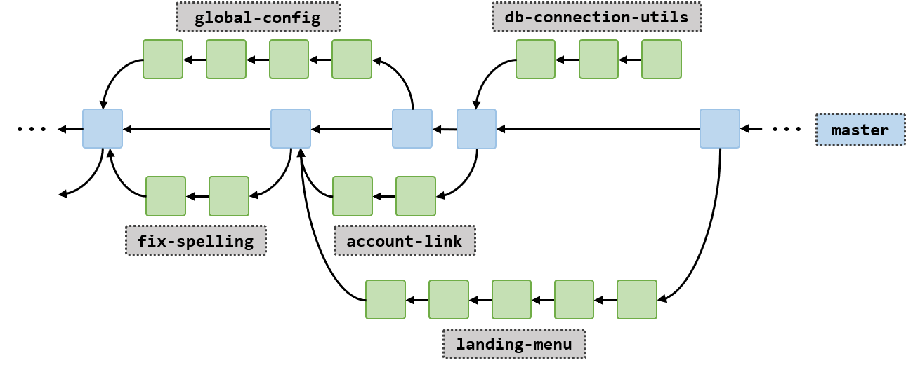
</p>

Como Chacon menciona en su post, las reglas de GitHub Flow son las siguientes:

- **Cualquier commit en `master` es desplegable** (libre de bugs mayores y listo para ser lanzado a producción). Me imagino que la única excepción a esta regla es justo al inicio del proyecto, cuando los fundamentos del producto aún están siendo construidos.
- **Para trabajar en algo nuevo (corrección de un bug, implementación de tests, añadir features o realizar hotfixes) crear una rama con un nombre descriptivo y trabajar ahí**. La única imposición aquí es que el nombre sea descriptivo, mas si se desea un tanto más de estandarización también podría ser posible haciendo cumplir una nomenclatura. Por ejemplo, toda rama que contribuya a un feature tener la estructura `feature/<nombre-del-feature>`.
- **Realice commits frecuentemente y regularmente haga push de su rama de trabajo**. De esta forma tendrá el respaldo de su trabajo en el servidor y otros miembros del equipo podrán revisarlo.
- **Cuando necesite ayuda o piense que una rama está lista para ser fusionada en `master`, utilice un *pull request***. Los pull requests son una increíble herramienta que GitHub ofrece (y otros servicios de almacenamiento de repositorios, como [GitLab](https://about.gitlab.com/) o [Bitbucket](https://bitbucket.org/product)) para hacer revisiones de ramas, permitiendo comentar sobre el código e intercambiar mensajes entre el autor y el encargado de la revisión.
- **Tras ser aceptado el pull request, fusionar la rama en `master`**. Tras ser fusionada la rama debería realizarse un despliegue a producción con el último commit de `master`.

En adición a dejar el contrato del workflow en voz o escrito, algunas reglas pueden hacerse cumplir mediante los [hooks de Git](https://git-scm.com/book/en/v2/Customizing-Git-Git-Hooks), como [estandarizar el nombre de las ramas](https://itnext.io/using-git-hooks-to-enforce-branch-naming-policy-ffd81fa01e5e) o [proteger `master` de commits directos](https://stackoverflow.com/questions/40462111/git-prevent-commits-in-master-branch).

Para una introducción interactiva a GitHub recomiendo [Git-it](http://jlord.us/git-it/), la cual también abarca varios fundamentos discutidos en [Parte 1: Fundamentos](Parte1_Fundamentos.md).

<a id="markdown-conociendo-más-flujos-de-trabajo" name="conociendo-más-flujos-de-trabajo"></a>
### Conociendo más flujos de trabajo

Recomiendo mucho explorar más flujos de trabajo, entre los cuales recomiendo [Git Flow](https://nvie.com/posts/a-successful-git-branching-model/) por su versatilidad y popularidad. Si está en busca de un trabajo es muy probable que el workflow utilizado en la compañía a la que aspira sea inspirado por Git Flow.

- Git Flow: <https://nvie.com/posts/a-successful-git-branching-model/>
- GitHub Flow: <http://scottchacon.com/2011/08/31/github-flow.html>
- Discusión general de workflows: <https://www.atlassian.com/git/tutorials/comparing-workflows>
- Trunk-based flows (e.g. GitHub Flow) vs GitFlow <https://www.toptal.com/software/trunk-based-development-git-flow>
- Integración continua con Git: <https://www.youtube.com/watch?v=TWM1YNzSwB8&list=LLO-gLu2Npbe6rRcMdTQ_ZIw&index=2&t=0s>

<a id="markdown-stashing-para-evitar-commits-parciales" name="stashing-para-evitar-commits-parciales"></a>
## Stashing para evitar commits parciales

> Resumen de <https://git-scm.com/book/en/v2/Git-Tools-Stashing-and-Cleaning>

Al trabajar en un proyecto podría surgir la necesidad de revisar una rama distinta en la que actualmente se trabaja. En ocasiones Git reporta un mensaje de error similar al siguiente cuando se intenta cambiar de rama sin haber primero hecho commit de los cambios del working tree.

```shell
error: Your local changes to the following files would be overwritten by checkout:
        foo.txt
Please commit your changes or stash them before you switch branches.
Aborting
```

También ocurre que a la mitad de la implementación de algún patch o feature, un repositorio remoto se actualiza y se desea traer los cambios al repositorio local. Si se tienen archivos modified y se realiza un pull, un mensaje similar al siguiente se observa.

```shell
error: Your local changes to the following files would be overwritten by merge:
        foo.txt
Please commit your changes or stash them before you switch branches.
Aborting
```

Si el trabajo en la rama actual aún no está listo para ser persistido en un commit, la solución yace en el stashing. **Para crear un stash, existen los comandos `git stash`, `git stash push` y `git stash save`. Ya que el último no es recomendado (es sintaxis antigua, sustituida por `git stash push`) y el primero está limitado, me centraré en crear stashes mediante `git stash push`**.

<a id="markdown-¿qué-es-un-stash" name="¿qué-es-un-stash"></a>
### ¿Qué es un stash?

**Un stash es un commit** (creado mediante alguno de los comandos anteriormente mencionados) que tiene la particularidad de no estar asociado a alguna rama. Los stashes se almacenan en una pila indizada a partir del cero. Es decir, al crearse un nuevo stash, su índice en la pila es cero; el que era cero se vuelve uno, el que era uno se vuelve dos, etc. El hash SHA-1 del stash con índice cero puede hallarse en `.git/refs/stash`. (Recuerde que un commit almacena las referencias a sus padres, por lo que basta con almacenar sólo el stash más reciente de la pila.)

**Al estar desacoplado de las ramas, los stashes pueden ser referidos en cualquier rama**. La idea es poder limpiar tanto el working tree como el staging area pero no perder los cambios, almacenándolos en un commit. Esto para poder cambiar de rama aún si no está listo para realizar un commit o en caso que requiera ejecutar `git pull`. Los cambios de este commit pueden ser luego aplicados al trabajar en una rama distinta o en la misma rama.

<a id="markdown-comandos-para-administrar-stashes" name="comandos-para-administrar-stashes"></a>
### Comandos para administrar stashes

Mostrar todos los stashes.

```bnf
git stash list
```

Crear un nuevo stash incluyendo sólo los archivos modificados.

- (`-u`) Incluyendo archivos modificados y untracked.
- (`-a`) Incluyendo archivos modificados, untracked e ignorados.
- (`-m`) Agregar mensaje al stash. Es posible utilizar la misma bandera de mensaje de commit (`-m`) para etiquetar al stash con un mensaje.

Adicionalmente, a diferencia de `git stash save` o simplemente `git stash`, `git stash push` permite especificar los archivos que se almacenan en el stash. Tras crear un stash, todo lo almacenado en tal commit es retirado del working tree.

```bnf
git stash push [-u | -a] [-m "<mensaje>"] [<archivos>]
```

Aplicar los cambios de un stash al working tree. El stash permanece en la pila (1); para aplicar los cambios y eliminar el stash de la pila úsese (2). Si un stash no es proporcionado, se utiliza el stash `stash@{0}` para ambos comandos.

**Nótese que si el stash tuviera conflictos con los archivos existentes en el working tree, por ejemplo, si en el stash existe un archivo `foo.txt` y en el working tree también, ninguno de los dos comandos realizaría cambio alguno sobre el stash o working tree**, reportando en su lugar un error. Para evitar este error y entrar en el modo de resolución de conflictos, añadir todas las modificaciones actuales al staging area y luego realizar un `git stash pop` o `git stash apply`.

🔍 **Tip.** [Recuperar stashes perdidos](https://stackoverflow.com/questions/32517870/how-to-undo-git-stash-clear) puede ser complicado, por ello recomiendo utilizar `git commit` incluso para cambios parciales si estos son muy significativos. Luego siempre es posible realizar un `git commit --amend` para terminar de componer el commit.

```bnf
git stash apply [stash@{<índice>}]  (1)
git stash pop [stash@{<índice>}]    (2)
```

Eliminar un stash, sin aplicar los cambios (1). Si ningún stash es proporcionado, se elimina `stash@{0}`. Eliminar todos los stashes de la pila (2).

```bnf
git stash drop [stash@{<índice>}]  (1)
git stash clear                    (2)
```

<a id="markdown-¿cuándo-puede-cambiarse-de-rama-sin-hacer-commit-o-stash-de-las-modificaciones" name="¿cuándo-puede-cambiarse-de-rama-sin-hacer-commit-o-stash-de-las-modificaciones"></a>
### ¿Cuándo puede cambiarse de rama sin hacer commit o stash de las modificaciones?

> Simplificación de <https://stackoverflow.com/questions/22053757/checkout-another-branch-when-there-are-uncommitted-changes-on-the-current-branch>

Al inicio de esta sección se mencionó que *en ocasiones* Git reporta un mensaje de error cuando se ejecuta un checkout a otra rama teniendo cambios uncommitted en el working tree. Esto implica que, en algunas situaciones, es posible cambiar de rama sin hacer commit de los cambios y sin perder los mismos. Puntualmente, sólo una condición debe satisfacerse para que la posibilidad exista.

<table>
  <tr>
    <td>
    Es posible cambiar de rama teniendo modificaciones uncommitted en el working tree si el cambio <b>no requiere deshacer</b> dichas modificaciones.
    </td>
  </tr>
</table>

Un cambio de rama conlleva un posible cambio del working tree, pues el working tree muestra el contenido almacenado en el snapshot asociado al commit al que apunta la rama. Pensemos en un ejemplo. Al cambiar de la rama `X` a la rama `Y` las siguientes acciones ocurren, donde `Xs` y `Ys` son los snapshots correspondientes de los commits a los que apuntan las ramas.

1. Para cada archivo en `Ys` y no en `Xs`, crearlo.
2. Para cada archivo en `Xs` y no en `Ys`, eliminarlo.
3. Para cada archivo en ambos snapshots, si la versión en `Ys` es distinta a la versión en `Xs`, actualizar el contenido.

Si en el cambio de rama algunas de estas acciones requiere ocurrir **sobre alguno de los archivos modificados o creados**, entonces Git cancela el checkout y muestra el mensaje de error presente al inicio de la sección. De lo contrario, el checkout es legal. Nótese la condición en la tercera acción; si el archivo existe en ambos snapshots, sólo se muestra la versión del snapshot `Ys` si es distinta a la del snapshot `Xs`, no si es distinta a la versión del working tree. En los siguientes casos siempre es posible un cambio de rama con cambios uncommitted.

- Se crea `rama-m` a partir de `rama-n`. Se trabaja en `rama-m`, modificando archivos y creando nuevos, pero no se realiza un commit. Es legal hacer checkout a `rama-n`. Esto se cumple siempre pues ambas ramas apuntan al mismo commit, que a su vez apunta al mismo snapshot. A pesar que la versión del working tree es distinta al snapshot, las versiones entre los snapshots son iguales, por lo que Git no intenta traer la versión del snapshot de la rama objeto del checkout.
- Se crean archivos cuyos nombres y extensiones no existen en otras ramas, es legal cambiar de rama. Puesto que el archivo está untracked y no existen en otras ramas, un cambio de rama no requiere creación, eliminación ni modificación sobre este archivo.

Ahora dirijamos nuestra atención a casos en los que no es posible un cambio de rama teniendo modificaciones uncommitted.

- Se crea un archivo cuyo nombre y extensión existen en otra rama. En la rama actual el archivo está untracked, pero en la rama objeto del checkout el archivo está tracked. Al intentar el cambio, se requiere la acción 1 (creación) sobre el nuevo archivo; en el snapshot de la rama origen no existe el archivo, pero en el snapshot de la rama destino sí, entonces se crea, pero en el proceso colisiona con el archivo modificado.
- Se modifica un archivo que en otra rama no existe. Es ilegal cambiarse a esa rama con la modificación uncommitted pues se requiere la acción 2 (eliminación) sobre el archivo modificado.

<a id="markdown-eliminar-archivos-untracked" name="eliminar-archivos-untracked"></a>
## Eliminar archivos untracked

> Resumen de <https://git-scm.com/docs/git-clean>

Eliminar archivos untracked. Ya sea por un build u otra razón, a veces simplemente se quiere eliminar los archivos no versionados por Git (untracked).

- (`-f`) Si la variable de configuración `clean.requireForce` no tiene el valor `false`, entonces la bandera `-f` siempre es requerida para ejecutar el comando.
- (`-d`) Recursivamente eliminar directorios untracked.
- (`-x`) Eliminar también archivos ignorados.

Si `<paths>` no es proporcionado, limpia el working tree desde el directorio en el que el comando es ejecutado.

```bnf
git clean [-f] [-d] [-x] [<path>]
```

<a id="markdown-ignorar-archivos-gitignore" name="ignorar-archivos-gitignore"></a>
## Ignorar archivos (.gitignore)

> Resumen de <https://git-scm.com/docs/gitignore>

Existen archivos de configuración de IDEs o editores de texto, como `.vscode` de VSCode o `.idea/workspace.xml` de IntelliJ IDEA, los cuales no se desean agregar al repositorio. De la misma intención son objeto los archivos resultantes de un build, como un directorio `target` o los `.class` de Java. Agregando un ejemplo más, las dependencias externas de un proyecto también suelen ser ignoradas, como el directorio `node_modules` de Node.js. En estos casos, dichos archivos se desean dejar permanentemente untracked.

La solución es ignorar los archivos, volviéndolos no elegibles para los comandos de Git. (Algunas banderas de algunos comandos permiten seleccionar archivos ignorados, como `-a` en `git stash push`o `-x` en `git clean`.) Para ignorar archivos se requiere un archivo de configuración `.gitignore`, el cual puede tener impacto global o sólo respecto a un repositorio. Los archivos a ignorar se seleccionan utilizando [expresiones glob](https://en.wikipedia.org/wiki/Glob_(programming)).

---

<a id="markdown-expresiones-glob-vs-regulares" name="expresiones-glob-vs-regulares"></a>
### Expresiones glob vs regulares

Varios comandos de Git requieren seleccionar archivos, como `git add` o `git stash push`. A pesar que pueda parecer que aceptan expresiones regulares, en realidad lo que aceptan son expresiones glob. Las expresiones glob sirven el propósito de representar archivos mediante wildcards (caracteres especiales), dado un sistema de archivos; mientras que las expresiones regulares representan cadenas de texto, dada una secuencia de caracteres.

Ambas expresiones sirven un propósito distinto aunque similar (y la sintaxis también es similar). Puesto que archivos se desean seleccionar en lugar de frases en un texto, las expresiones regulares no son ideales en este contexto. **Cuando los glob se utilizan en comandos, como `git add` por ejemplo, ponerlos entre comillas para evitar expansión del shell**.

| ✔️ Evitar expansión de shell. Git procesa el glob | ❌ Expansión de shell. El shell expande la ruta y pasa la evaluación a Git. Git no procesa un glob |
|:---:|:---:|
| `git add '**/*.txt'` | `git add **/*.txt` |

---

<a id="markdown-notación-de-expresiones-glob" name="notación-de-expresiones-glob"></a>
### Notación de expresiones glob

| Símbolo | Explicación |
|:---:|---|
| * | Representa cualquier número de caracteres, incluido ninguno, pero no una diagonal. |
| ** | Representa uno o más directorios, pero no el directorio actual (`.`) ni el padre (`..`). |
| ? | Representa un carácter. |
| [abc] | Representa cualquier carácter contenido en los corchetes. |
| [a-z] | Representa cualquier carácter contenido en el intervalo definido por los corchetes. Este intervalo es dependiente de la configuración regional. |

<a id="markdown-gitignore" name="gitignore"></a>
### .gitignore

Este archivo define los archivos que Git ignorará. **Archivos tracked no son afectados**. El archivo puede contener comentarios de una línea, los cuales inician con `#`. Para especificar archivos a ignorar, colocar un patrón glob por línea. Si se ignora un directorio, todos sus archivos y subdirectorios también son ignorados. Un repositorio puede tener más de un `.gitignore`, siendo sus patrones glob relativos a la ubicación del archivo.

<p align="center">
 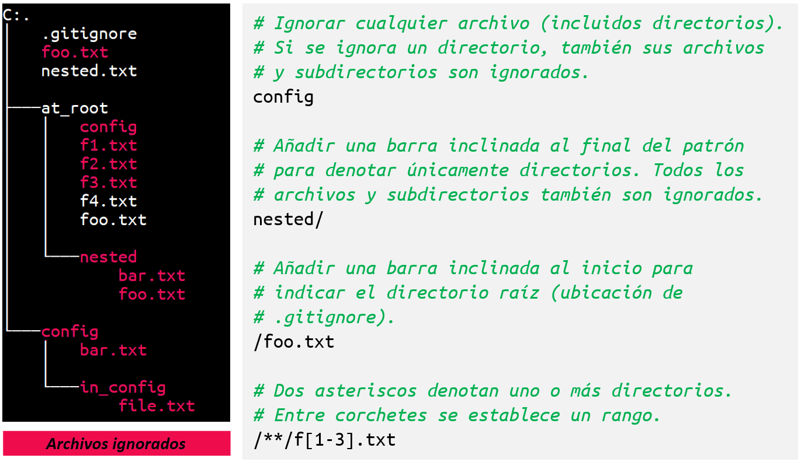
</p>

Git permite definir un `.gitignore` de impacto global (afecta todos los repositorios del usuario con esta configuración). Primero es necesario crear el archivo manualmente, luego se indica su ubicación en la configuración global.

```bnf
git config --global core.excludesFile <ruta-.gitignore>
```

<a id="markdown-ignorar-archivos-tracked" name="ignorar-archivos-tracked"></a>
### Ignorar archivos tracked

Para ignorar archivos tracked (añadidos al staging environment o existentes en algún commit) primero deben ser olvidados por Git, es decir, cambiar su estado a untracked. Para conseguir esto se utiliza el comando siguiente, donde `<archivo>` acepta expresiones glob.

```bnf
git rm --cached <archivo>
```

<a id="markdown-el-confuso-archivo-gitkeep-y-los-directorios-vacíos" name="el-confuso-archivo-gitkeep-y-los-directorios-vacíos"></a>
## El confuso archivo `.gitkeep` y los directorios vacíos

Consideremos el siguiente experimento.

```bash
$ git init
Initialized empty Git repository in C:/Users/hjcer/temp/.git/

$ mkdir foo

$ git status
On branch master

No commits yet

# A pesar que el directorio foo existe en el working tree, Git
# no lo reconoce, negando la posibilidad de agregarlo al staging
# area y almacenarlo en un commit.
nothing to commit (create/copy files and use "git add" to track)
```

¿Nota algo extraño? **Git no versiona directorios vacíos**.

<p align="center">
 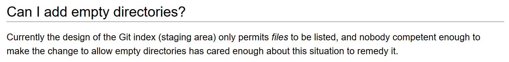
</p>

> Recuperado de <https://git.wiki.kernel.org/index.php/GitFaq#Can_I_add_empty_directories.3F>

 En algunas situaciones podría resultar deseable almacenar en los commits ciertos directorios vacíos. Existen varias recomendaciones respecto a cómo conseguir esto, siendo una de las más populares crear un archivo con nombre `.gitkeep` en el directorio en cuestión, para que ya no esté vacío y pueda ser registrado por Git. En mi opinión, esta convención es muy confusa y no la recomiendo. `.gitkeep` no es un archivo que Git trate de forma especial, como lo serían por ejemplo [`.gitignore`](#ignorar-archivos-(.gitignore)) o `.gitconfig`, por lo que no tiene documentación oficial su uso; el prefijo `git` sugiere que es un archivo de configuración, cuando en realidad no lo es.

 Para registrar directorios vacíos recomiendo utilizar un `readme.md` explicando la razón de la necesidad de hacer tracking de tal carpeta.

<a id="markdown-reescribiendo-la-historia" name="reescribiendo-la-historia"></a>
## Reescribiendo la historia

Al colaborar en un repositorio visto y trabajado por otras personas, existe una regla de oro:

<table>
  <tr align="center">
    <td>
    <b>
    No reescribir la historia pública.
    </b>
    </td>
  </tr>
</table>

Más que una regla, presento esto como una fuerte recomendación, pues es posible que los colaboradores acuerden reescribir parte de la historia y se haga de forma segura, pero lograr esto puede resultar complejo, muy confuso e innecesario. En general, se reescribe la historia pública por equivocación y no por una decisión meditada.

<a id="markdown-¿qué-es-reescribir-la-historia" name="¿qué-es-reescribir-la-historia"></a>
### ¿Qué es *reescribir la historia*?

Primero hay que recordar que la historia de Git se compone por el árbol de commits, donde cada commit es identificado por un hash SHA-1. Cualquier sustitución o eliminación a esta secuencia de hashes se considera reescribir la historia.

<table>
  <tr>
    <td>
    Se dice que la historia es reescrita si la secuencia de hashes en el árbol de commits cambia por acción de sustitución (<code>git commit --amend</code> o <code>git rebase</code>) o eliminación (<code>git reset</code> o <code>git rebase</code>). Agregar commits secuenciales (<code>git commit</code>) no reescribe la historia, pues no altera el pasado.
    </td>
  </tr>
</table>

Veamos un ejemplo sencillo utilizando `git commit --amend`.

```bash
$ git log --oneline --all --graph
 # Observe que el hash del commit al que apunta HEAD es 1c0e104.
*   1c0e104 (HEAD -> master, origin/master) Merge branch 'feature'
|\
| * 1c27aea (feature) Add more content to f1
| * 5a4b4dd Add content to f2
* | 494804a Create f3
|/
* a9e3559 Create f2
* 44b6f5d Modify f1
* d04b4ee Start version control

$ git commit --amend --no-edit
[master 5b9a0ca] Merge branch 'feature'
 Date: Sun Dec 22 12:20:44 2019 -0600

$ git log --oneline --all --graph
 # El hash ha cambiado de 1c0e104 a 5b9a0ca,
 # no se trata del mismo objeto commit.
*   5b9a0ca (HEAD -> master, origin/master) Merge branch 'feature'
|\
| * 1c27aea (feature) Add more content to f1
| * 5a4b4dd Add content to f2
* | 494804a Create f3
|/
* a9e3559 Create f2
* 44b6f5d Modify f1
* d04b4ee Start version control
```

¿Por qué es importante que los hashes cambien si su contenido es el deseado (y en este ejemplo incluso es el mismo)? Esto sólo es importante en el contexto de repositorios remotos y colaboradores. Considere a un colaborador que trabajaba con la versión antigua y ejecuta un `git fetch origin` para revisar los cambios.

```bash
$ git fetch origin
remote: Enumerating objects: 4, done.
remote: Counting objects: 100% (4/4), done.
remote: Compressing objects: 100% (2/2), done.
remote: Total 2 (delta 0), reused 2 (delta 0), pack-reused 0
Unpacking objects: 100% (2/2), done.
From https://github.com/HerCerM/RewritingHistory
 + 1c0e104...5b9a0ca master     -> origin/master  (forced update)

$ git log --oneline --all --graph
    # Después del amend
*   5b9a0ca (origin/master, origin/HEAD) Merge branch 'feature'
|\      # Antes del amend
| | *   1c0e104 (HEAD -> master) Merge branch 'feature'
| | |\
| |/ /
|/| /
| |/
| * 1c27aea Add more content to f1
| * 5a4b4dd Add content to f2
* | 494804a Create f3
|/
* a9e3559 Create f2
* 44b6f5d Modify f1
* d04b4ee Start version control
```

De pronto `origin/master` y `master` apuntan a commits distintos a pesar que la versión de los archivos entre ellos es la misma. Esta divergencia, quizá no anticipada, puede ocasionar problemas y hacer la historia de commits confusa.

<a id="markdown-¿qué-es-la-historia-pública" name="¿qué-es-la-historia-pública"></a>
### ¿Qué es la *historia pública*?

Todo commit que exista en un repositorio remoto público (al menos para un grupo selecto de personas) es parte de la historia pública.

<p align="center">
 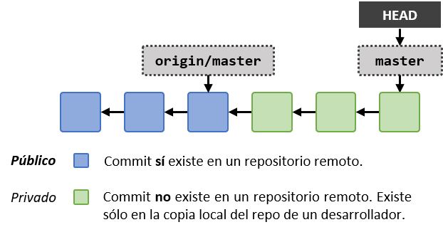
</p>

Consideremos el diagrama superior que muestra un pequeño repositorio de ejemplo. Los commits marcados de azul existen en el repositorio identificado por `origin`, lo cual significa que otras personas con acceso a `origin` pueden ver estos commits y más aún, si son colaboradores, muy seguramente han basado su trabajo sobre estos commits.

Observe que la regla de oro propone *no reescribir la historia **pública***, pues no existe ningún peligro en reescribir la historia local. Mientras los commits no hayan sido publicados (`git push`) a un repositorio remoto, siéntase libre de sustituirlos o eliminarlos utilizando `git commit --amend`, `git reset` o `git rebase`. Por esta razón es una excelente práctica sólo hacer `git push` de sus commits cuando esté totalmente satisfecho con ellos, pues una vez publicados es mejor considerarlos tallados en piedra.

<a id="markdown-¿cómo-se-corrigen-commits-públicos" name="¿cómo-se-corrigen-commits-públicos"></a>
### ¿Cómo se corrigen commits públicos?

A pesar que es posible reescribir la historia de forma segura si los colaboradores lo pueden manejar, es recomendable no hacerlo. En lugar de reescribir la historia, considere utilizar [`git revert`](#revert) para añadir commits con las correcciones.

<a id="markdown-correcciones-avanzadas" name="correcciones-avanzadas"></a>
## Correcciones avanzadas

<a id="markdown-cherry-pick" name="cherry-pick"></a>
### Cherry pick

En [Parte 1: Fundamentos](Parte1_Fundamentos.md) en la sección de fusión de ramas, se habla que existen dos formas de integrar cambios de una rama a otra: `git merge` (tema central de tal sección) y [`git rebase`](#rebase) (comando no abarcado por la sección pero sí cubierto en esta parte 2 del manual). Existe una tercera forma: `git cherry-pick`. Este comando permite aplicar commits arbitrarios sobre la referencia `HEAD`. El caso de uso más popular de este comando requiere de dos ramas, cuando se desea aplicar un commit de una rama a la otra rama y un merge o rebase no es posible pues el trabajo en las ramas no ha sido concluido y por lo tanto no está listo para ser fusionado.

<p align="center">
 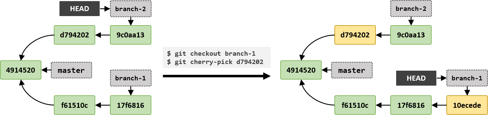
</p>

Tras ejecutar `git cherry-pick` se añade un nuevo commit después de `17f6816` que introduce los mismos cambios que `d794202`. Es importante señalar que los commits son diferentes (tienen un SHA-1 distinto), mas los cambios que introducen son idénticos. Los commits que introducen los mismos cambios son señalados con amarillo. Puede pensarse que `10ecede` es una copia de `d794202`.

<a id="markdown-uso-del-comando" name="uso-del-comando"></a>
#### Uso del comando

- (`-e`) Permite modificar el mensaje del commit antes de aplicar el nuevo commit.
- (`-n`) En lugar de crear un commit con los cambios, añade los cambios al working tree e index.
- (`<commit>`) Commit (referencia absoluta o relativa) que se copiará sobre `HEAD`.

```bnf
git cherry-pick  [-e | --edit] [-n | --no-commit] <commit>
```

<a id="markdown-crítica-de-cherry-pick" name="crítica-de-cherry-pick"></a>
#### Crítica de cherry pick

Lo más importante a notar acerca de este comando es que su aplicación resulta en dos commits físicamente distintos (hashes SHA-1 diferentes, por lo tanto, commits diferentes) pero al mismo tiempo, dos commits lógicamente idénticos (pues ambos introducen los mismo cambios). Esto puede resultar en una historia confusa de leer merced la duplicación y longitud extra causada por los mismos commits duplicados. Es por esta razón que no se recomienda basar el medio de integración de cambios en cherry pick, se prefiere merge o rebase.

Sin embargo, existen casos en los que realizar un cherry pick es una buena idea. En mi experiencia este comando resulta particularmente útil para recuperar commits extraviados en el reflog, caso en el cual se logra la recuperación del commit y no se genera una duplicación de commits lógicos en la historia.

<a id="markdown-reset" name="reset"></a>
### Reset

> Resumen de <https://www.atlassian.com/git/tutorials/undoing-changes/git-reset>

⚠️ Este comando reescribe la historia, vea [reescribiendo la historia](#reescribiendo-la-historia) para conocer por qué esto puede ser peligroso.

Este comando es muy interesante, poderoso y directo de comprender si se tiene un claro entendimiento del ambiente de desarrollo de Git, discutido en [Parte 1: Fundamentos](Parte1_Fundamentos.md). Similar a `git checkout`, este comando permite mover la referencia `HEAD` entre commits, mas difiere en tanto que no sólo actúa respecto a `HEAD`, sino que también respecto a una rama. Por ejemplo, considere el siguiente árbol de commits.

<p align="center">
 
</p>

Se observa que `git checkout` mueve `HEAD`, pero `git reset` también mueve a la rama apuntada por `HEAD`.

<p align="center">
 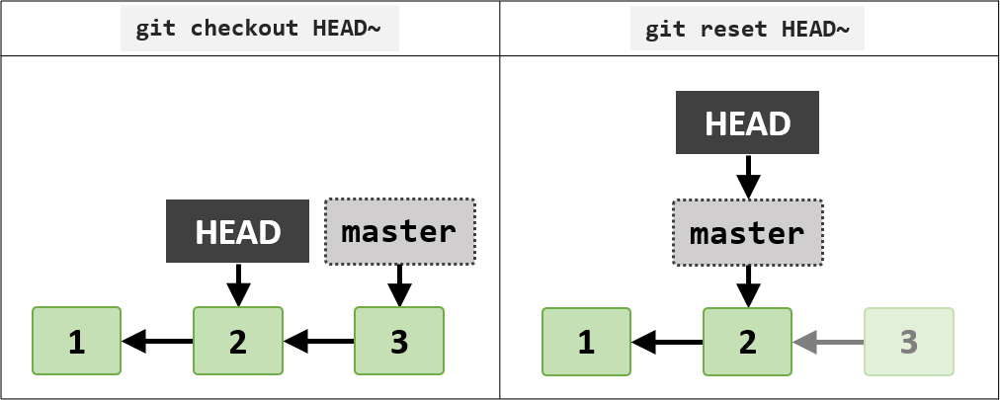
</p>

Existen tres modalidades de reseteos, las cuales son elegibles por las banderas `--soft`, `--mixed` y `--hard`. Observe que `--mixed` es utilizada por defecto si ninguna bandera es seleccionada. **Las tres modalidades tienen en común que mueven `HEAD` y la rama apuntada por `HEAD` al commit seleccionado**. Los modos difieren en lo que restauran (sobre qué tiene efecto el reset), siendo los objetivos de restauración el working tree y el staging area. En cuanto al staging area, restaurar alude a retirar los archivos del estado staged, mas los cambios se mantienen en el working tree. Respecto al working tree, restaurar significa actualizar el mismo respecto al snapshot del commit seleccionado, perdiendo toda modificación en el working tree.

| Modalidad | Objetivo de restauración |
|---|---|
| `--soft` | (Ni el staging area ni el working tree son restaurados, sólo `HEAD` y la rama apuntada por `HEAD` son movidos.)<br><br>*Las modificaciones de los commits descendientes del commit seleccionado son **colocadas en el staging area** (evidentemente, son visibles también en el working tree).* |
| `--mixed`<br><br>*modo predeterminado* | Staging area<br><br>*Las modificaciones de los commits descendientes del commit seleccionado son **colocadas en el working tree** (unstaged).* |
|`--hard`| Staging area y working tree<br><br>⚠️ ***Las modificaciones de los commits descendientes del commit seleccionado son ELIMINADAS***. |

<a id="markdown-uso-del-comando-1" name="uso-del-comando-1"></a>
#### Uso del comando

Retira del staging area los archivos especificados (1). Si alguno de los archivos inicia con un guión alto (`-`), añadir dos guiones altos antes del nombre del archivo (esto evita que Git intente procesar el archivo como una bandera). Para el reset discutido anteriormente, utilice (2). La sintaxis completa puede encontrarla en <https://git-scm.com/docs/git-reset>.

```bnf
git reset [--] <archivos>                       (1)
git reset [--soft | --mixed | --hard] <commit>  (2)
```

Para demostrar el uso del comando considere el siguiente repositorio.

```shell
$ git log --oneline
ca4ae71 (HEAD -> master) Add a body to foo.txt
edea02a Add title to foo.txt
d96dc66 Add file foo.txt
35554aa Create README.md
```

---

**Ejemplo 1. Mover últimos commits de `master` a nueva rama `feature/foo`**

```shell
$ git branch feature/foo

$ git reset --hard HEAD~3
HEAD is now at 35554aa Create README.md
```

Ahora sólo el primer commit (crear un `README.md`) pertenece a `master`. Porque una imagen vale mil palabras, a continuación se explican los comandos con diagramas.

<p align="center">
  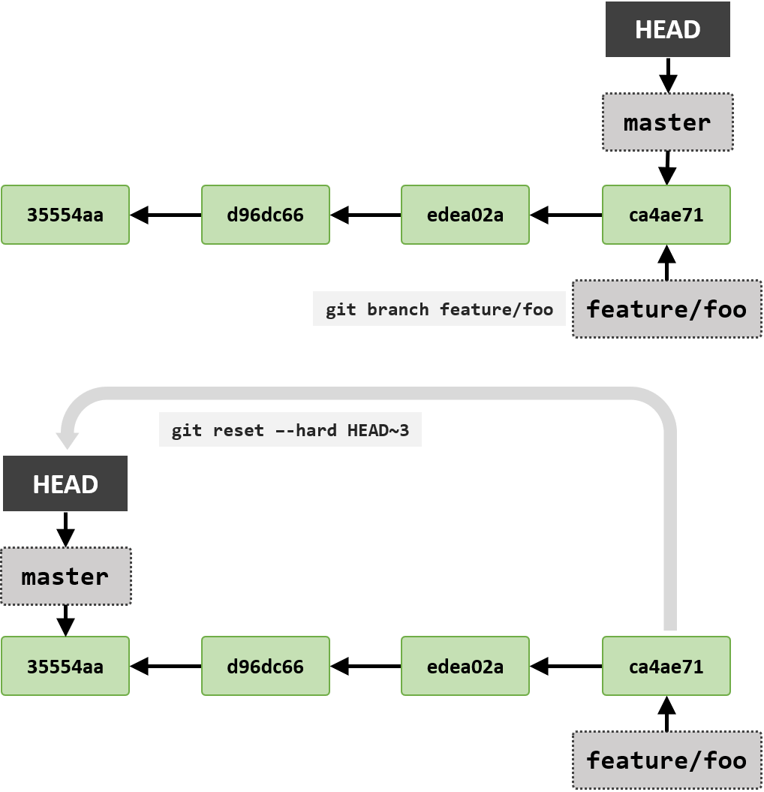
</p>

---

---

**Ejemplo 1.1. Compactar commits de `feature/foo` en tan sólo uno**

Veamos que los commits de `feature/foo` cumplen un sólo propósito: crear `foo.txt` con el contenido deseado. Digamos que en este proyecto tiene más sentido tener un sólo commit para contener estos cambios.

```shell
$ git checkout feature/foo
Switched to branch 'feature/foo'

$ git reset --soft HEAD~2

$ git commit --amend -m "Create foo.txt"
[feature/foo 3cbc27e] Create foo.txt
 Date: Thu Dec 26 09:44:59 2019 -0600
 1 file changed, 3 insertions(+)
 create mode 100644 foo.txt
```

<p align="center">
  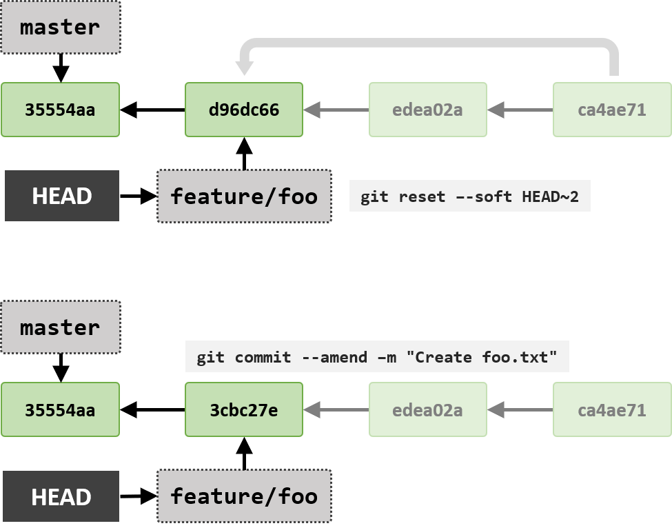
</p>

---

<a id="markdown-recuperación-de-un-git-reset---hard-equivocado" name="recuperación-de-un-git-reset---hard-equivocado"></a>
#### Recuperación de un `git reset --hard` equivocado

Al realizar un reset duro, los commits descendientes del seleccionado se vuelven inaccesibles mediante `git log` y su contenido es eliminado del working tree y staging area. En la imagen inferior podemos notar que el commit 3 no es listado tras el reset duro.

<p align="center">
 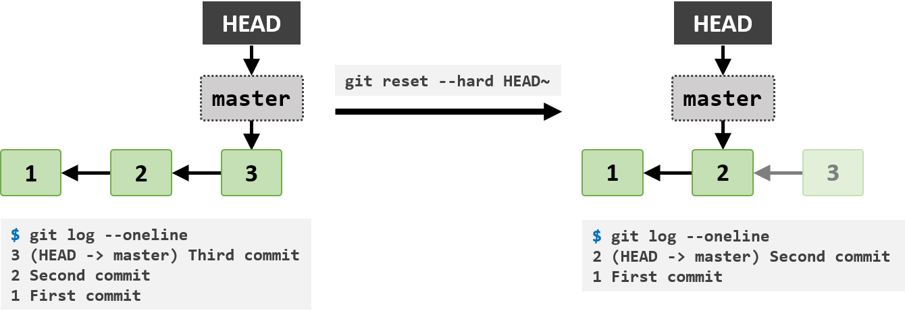
</p>

Esto no significa que el commit 3 sea inaccesible, tan sólo que recorriendo el árbol de commits a partir de `HEAD` (o cualquier `head`) no es posible llegar a él. El commit no ha sido eliminado. Para recuperase de este reset basta con hallar el hash SHA-1 del commit al que deseamos regresar y ejecutar un reset duro respecto al mismo. Para hallar el hash, se utiliza `git reflog`, que lista el historial de commits que ha visitado `HEAD`. Para el ejemplo presentado la solución es dada por `git reset --hard 3`.

<a id="markdown-revert" name="revert"></a>
### Revert

> Resumen de <https://www.atlassian.com/git/tutorials/undoing-changes/git-revert>

Al igual que `git reset`, `git revert` permite eliminar cambios introducidos por uno o más commits. La distinción más importante radica en que este comando no modifica la historia, realizando la corrección no al eliminar commits, pero al agregar uno con las correcciones.

<p align="center">
 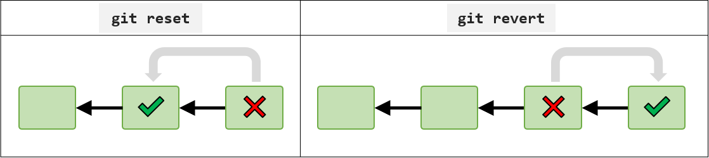
</p>

<a id="markdown-¿cuándo-utilizar-git-revert-sobre-git-reset" name="¿cuándo-utilizar-git-revert-sobre-git-reset"></a>
#### ¿Cuándo utilizar `git revert` sobre `git reset`?

Revert permite deshacer los cambios introducidos por commits selectos (incluso commits no secuenciales o muy atrás en la historia), mientras que reset sólo puede deshacer hacia atrás a partir de la punta de una rama. Revert siempre es seguro, pues no altera la la historia del repositorio, haciendo imposible reescribir la historia un repo remoto mediante revert. Por otra lado, reset sí puede reescribir la historia de un repo remoto si es utilizado incorrectamente. **Sólo utilizar `git reset` sobre commits que aún no han sido publicados (push)**. A pesar de estas desventajas, recomiendo utilizar reset en los casos que es posible, ilustrado por el diagrama inferior, pues evita el commit extra de corrección.

<p align="center">
 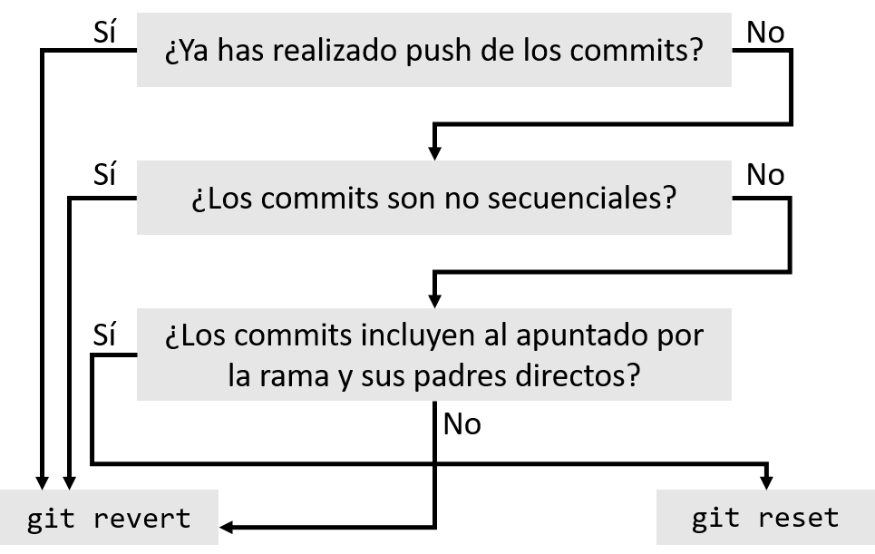
</p>

Los cambios de los commits no secuenciales también pueden ser eliminados con un rebase interactivo, evitando así commits extra por revert. Sin embargo, cualquiera de los dos comandos ofrecen el mismo estado final del proyecto.

<a id="markdown-uso-del-comando-2" name="uso-del-comando-2"></a>
#### Uso del comando

Crea un nuevo commit con la corrección, abriendo el editor de texto especificado en `core.editor` para ingresar el mensaje del commit.

- (`--no-edit`) No abrir el editor de texto y usar el mensaje predeterminado.
- (`-n`) En lugar de directamente crear un commit, las modificaciones son realizadas en el working tree y colocadas en el staging area.
- (`<commit>`) Commit cuyos cambios desean ser revertidos.

Como es usual, aquí se presenta una sintaxis simplificada respecto a las banderas y opciones más comunes. Para la sintaxis completa refiérase a <https://git-scm.com/docs/git-revert>.

```bnf
git revert [--no-edit] [-n] <commit>
```

Para demostrar distintas correcciones utilizando este comando, considere este repositorio.

```shell
$ git log --oneline
dc01f42 (HEAD -> master) Add content to file_2
386a54a Create file_2
e3646e8 Add content to file_1
98a0ead Create file_1
```

<p align="center">
 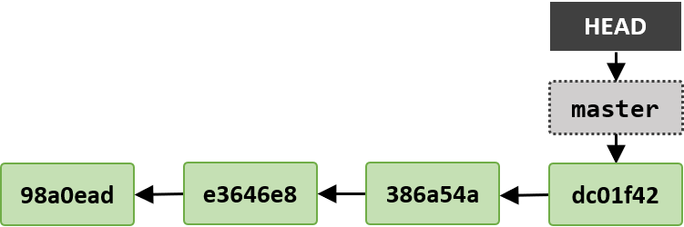
</p>

---

**Ejemplo 1. Eliminar modificaciones del último commit**

```bash
$ git revert HEAD
[master f5544d9] Revert "Add content to file_2"
 1 file changed, 1 deletion(-)

$ git log --oneline
f5544d9 (HEAD -> master) Revert "Add content to file_2" # Commit con la corrección
dc01f42 Add content to file_2
386a54a Create file_2
e3646e8 Add content to file_1
98a0ead Create file_1
```

<p align="center">
 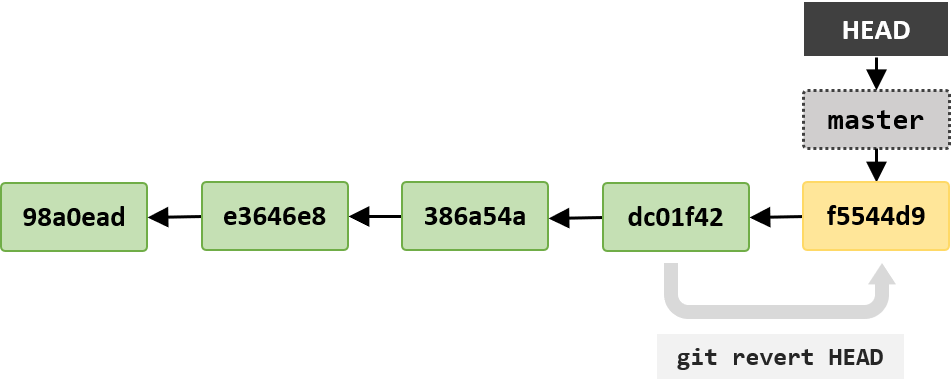
</p>

Este comando abre el editor de texto para pedir el mensaje del commit de corrección. (Si prefiere evitar el editor de texto y aceptar el mensaje predeterminado, use `git revert --no-edit HEAD`.) Tras salir del editor, puede verificar que un nuevo commit ha sido creado. Esta corrección pudo haberse realizado mediante un reset duro, pero al emplear un revert se evita reescribir la historia, lo cual casi nunca no es recomendable hacer en los commits de una rama pública (rama publicada a un repo remoto).

---

---

**Ejemplo 2. Eliminar modificaciones de commits no secuenciales**

```bash
# Recuerde que `git revert` revierte sólo los cambios del commit especificado.
# Intentar revertir el primer commit (creación de file_1) entra en conflicto
# con el segundo commit (HEAD~2), pues éste agrega contenido al archivo que
# se intenta eliminar.
$ git revert HEAD~3
error: could not revert 98a0ead... Create file_1
hint: after resolving the conflicts, mark the corrected paths
hint: with 'git add <paths>' or 'git rm <paths>'
hint: and commit the result with 'git commit'

# Resolver el conflicto eliminando el archivo manualmente.
$ git rm file_1.txt
rm 'file_1.txt'

# Continuar el revert.
$ git revert --continue
[master 98b6774] Revert "Create file_1"
 1 file changed, 1 deletion(-)
 delete mode 100644 file_1.txt

# Revertir añadir contenido a file_2 no entra en conflicto con las
# modificaciones del commit siguiente, entonces el proceso de revert
# es completamente automático y directo.
$ git revert --no-edit HEAD~
[master 90e5838] Revert "Add content to file_2"
 Date: Mon Dec 16 19:43:05 2019 -0600
 1 file changed, 1 deletion(-)

$ git log --oneline
90e5838 (HEAD -> master) Revert "Add content to file_2"
98b6774 Revert "Create file_1"
dc01f42 Add content to file_2
386a54a Create file_2
e3646e8 Add content to file_1
98a0ead Create file_1
```

<p align="center">
 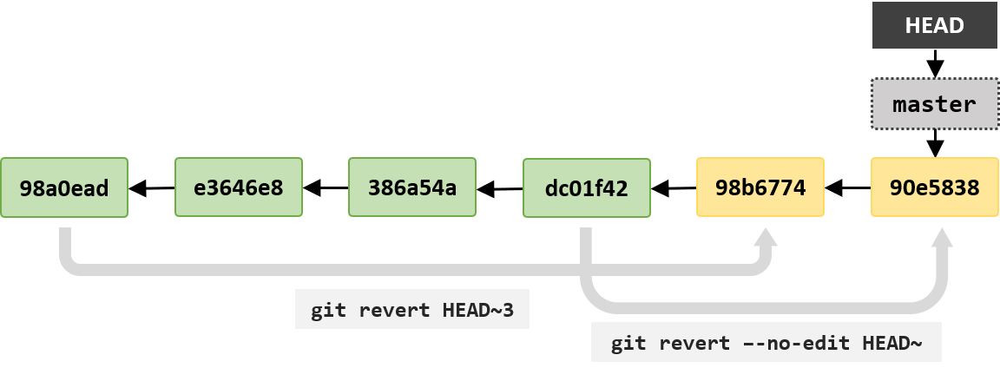
</p>

Aquí se hace énfasis en la falta de secuencia de los commits pues esto no sería posible utilizando `git reset`. Evidentemente, si los commits fueran secuenciales, el mismo proceso puede utilizarse. Puede verse que si se intenta revertir algún commit que tenga conflicto con un descendiente ocurre un conflicto, el cual se resuelve manualmente, se añaden las resoluciones al staging area y se ejecuta `git revert --continue`.

---

<a id="markdown-rebase" name="rebase"></a>
### Rebase

⚠️ Este comando reescribe la historia, vea [reescribiendo la historia](#reescribiendo-la-historia) para conocer por qué esto puede ser peligroso. A comparación con [`git reset`](#reset), restaurar el estado del árbol de commits después de un rebase podría resultar más complicado de razonar.

Esta sección explora el muy poderoso comando `git rebase`, cuya función es clonar una secuencia de commits y aplicarlos sobre una base distinta. Por clonar me refiero a copiar los snapshots a los que apuntan, al igual que el resto de sus datos (commiter, fecha y mensaje), pero cambiar la base (commit padre) de la secuencia seleccionada.

El comando tiene un modo interactivo que permite realizar correcciones que no serían posibles con [`git reset`](#reset) ni con [`git revert`](#revert), como modificar el mensaje o snapshot de un commit muy atrás en la historia, reordenar commits, o eliminar commits intermedios.

La primera sintaxis (1) es para el rebase interactivo; la segunda (2), para el no interactivo. En los siguientes dos apartados se exploran ambos modos, respectivamente. Ambas sintaxis son simplificadas de acuerdo a lo mostrado en los ejemplos, para la sintaxis completa vea <https://git-scm.com/docs/git-rebase>.

```bnf
git rebase [-i | --interactive] (<padre> | --root)  (1)
git rebase <nuevo-padre> [<rama>]                   (2)
```

<a id="markdown-rebase-interactivo" name="rebase-interactivo"></a>
#### Rebase interactivo

Para ilustrar este modo, pensemos en la siguiente situación. Alguien acaba de iniciar un proyecto de documentación, teniendo como primer commit la creación del `README.md`. Después de unos cuantos commits observa que hay una falta de ortografía en el `README.md`, pero en lugar de crear un nuevo commit para resolverlo desea modificar el primer commit.

```bash
$ git log --oneline
* fd0f171 (HEAD -> part-1) Add notes about basic branch commands
* 3dba01b Add notes about what a branch is
* 8161b46 Add notes about introductory concepts and commands
* 9daa971 Add preliminary notes before diving in the development environment
* 79944e8 (master) Start of version control

$ cat README.md
# ...
# Se quiere cambiar coneceptos -> conceptos modificando el primer commit
El énfasis respecto a los coneceptos por sobre los comandos es inspirado
# ...
```

<p align="center">
 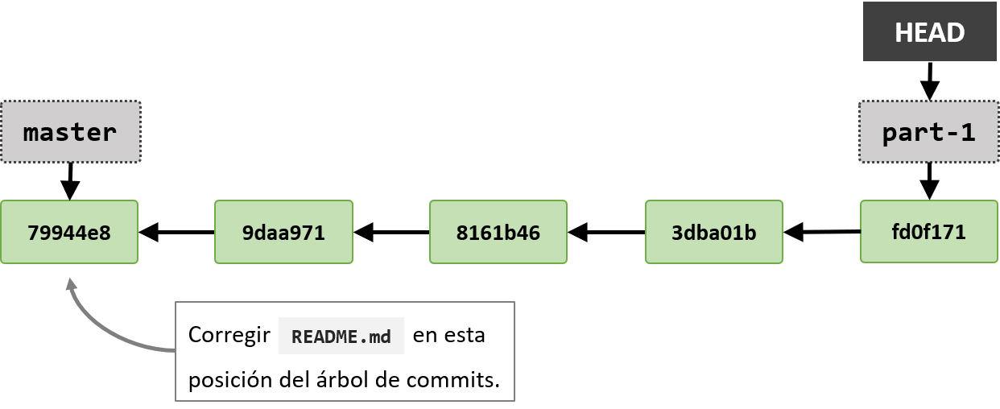
</p>

🔍 El proceso de rebase interactivo (y no interactivo) **sí crea nuevos commits**, con los cuales sustituye los antiguos. Mas como es un proceso de sustitución y no aumenta el número de commits del árbol, parece que no agrega. Sin embargo los hashes cambian, vea [reescribiendo la historia](#reescribiendo-la-historia) para conocer la importancia de esto.

Pues se desea modificar el primer commit, se ejecuta el rebase con la bandera `--root`. Apuntando `HEAD` a `part-1`, se ejecuta `git rebase -i --root` y el editor de texto configurado en `core.editor` muestra lo siguiente.

```bash
pick 79944e8 Start of version control
pick 9daa971 Add preliminary notes before diving into the development environment
pick 8161b46 Add notes about introductory concepts and commands
pick 3dba01b Add notes about what a branch is
pick fd0f171 Add notes about basic branch commands

# Rebase fd0f171 onto 3dba01b (5 commands)
#
# Commands:
# p, pick <commit> = use commit
# r, reword <commit> = use commit, but edit the commit message
# e, edit <commit> = use commit, but stop for amending
# s, squash <commit> = use commit, but meld into previous commit
# f, fixup <commit> = like "squash", but discard this commit's log message
# x, exec <command> = run command (the rest of the line) using shell
# b, break = stop here (continue rebase later with 'git rebase --continue')
# d, drop <commit> = remove commit
# l, label <label> = label current HEAD with a name
# t, reset <label> = reset HEAD to a label
# m, merge [-C <commit> | -c <commit>] <label> [# <oneline>]
# .       create a merge commit using the original merge commit's
# .       message (or the oneline, if no original merge commit was
# .       specified). Use -c <commit> to reword the commit message.
#
# These lines can be re-ordered; they are executed from top to bottom.
#
# If you remove a line here THAT COMMIT WILL BE LOST.
#
# However, if you remove everything, the rebase will be aborted.
#
# Note that empty commits are commented out
```

Todas las líneas empezando con `#` son comentarios explicando el proceso de rebase interactivo. Como puede leer, **si elimina una línea que representa a un commit éste será eliminado del árbol de commits**. También puede cambiar el orden de los commits y más interesante aún, puede utilizar las opciones que se muestran en los comentarios. Se desea editar el primer commit, así que se hace la siguiente sustitución.

```bash
# ANTES
pick 79944e8 Start of version control
pick 9daa971 Add preliminary notes before diving into the development environment
pick 8161b46 Add notes about introductory concepts and commands
pick 3dba01b Add notes about what a branch is
pick fd0f171 Add notes about basic branch commands
#...

#DESPUÉS
edit 79944e8 Start of version control # pick -> edit
pick 9daa971 Add preliminary notes before diving into the development environment
pick 8161b46 Add notes about introductory concepts and commands
pick 3dba01b Add notes about what a branch is
pick fd0f171 Add notes about basic branch commands
#...
```

Luego se guarda el cambio y se cierra el editor de texto. Entonces se muestra el commit en el que se ha detenido el proceso y las instrucciones para la edición.

```shell
$ git rebase -i --root
Stopped at 79944e8...  Start of version control
You can amend the commit now, with

  git commit --amend

Once you are satisfied with your changes, run

  git rebase --continue
```

Para realizar la corrección se modifica `README.md` y se ejecuta un amend. Luego se continúa el rebase.

```bash
# Editar README.md

$ git commit -a --amend --no-edit
[detached HEAD 193bf98] Start of version control
 Date: Wed Dec 18 11:54:42 2019 -0600
 3 files changed, 10 insertions(+)
 create mode 100644 Parte1_Fundamentos.md
 create mode 100644 Parte2_Profundizando.md
 create mode 100644 README.md

$ git rebase --continue
Successfully rebased and updated refs/heads/part-1.
```

Si tras el rebase visualiza el log de commits verá algo interesante y [potencialmente peligroso](#reescribiendo-la-historia): **los hashes de los commits han cambiado, es decir, no se trata de los mismo commits**. En esta ocasión tiene una consecuencia peculiar: `master` parece haber desaparecido.

```bash
# Antes del rebase
$ git log --oneline
* fd0f171 (HEAD -> part-1) Add notes about basic branch commands
* 3dba01b Add notes about what a branch is
* 8161b46 Add notes about introductory concepts and commands
* 9daa971 Add preliminary notes before diving into the development environment
* 79944e8 (master) Start of version control

# Después del rebase
$ git log --oneline
9c59bf2 (HEAD -> part-1) Add notes about basic branch commands
9cf8acc Add notes about what a branch is
752ba23 Add notes about introductory concepts and commands
06f3efe Add preliminary notes before diving into the development environment
193bf98 Start of version control # master sigue apuntando a 79944e8
```

Tras el rebase existen dos árboles distintos de commits. El original en el que aún existe `master` y el nuevo.

<p align="center">
 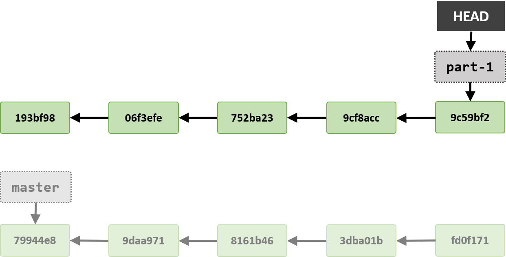
</p>

Para terminar la corrección se realiza lo siguiente.

```shell
$ git checkout master
Switched to branch 'master'

$ git reset --hard 193bf98
HEAD is now at 193bf98 Start of version control
```

<p align="center">
 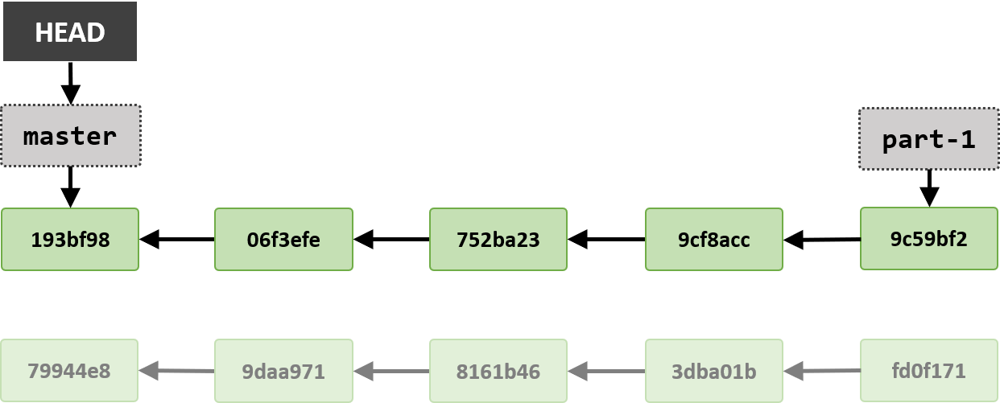
</p>

Ahora pensemos que el desarrollador desea compactar los últimos dos commits (que corresponden a notas acerca de ramas) en uno solo. Como se muestra en la sección dedicada a [`git reset`](#reset), esto puede lograrse utilizando tal comando, pero veamos cómo se lograría con un rebase interactivo.

Se desea editar los últimos dos commits de `part-1`. En la rama `part-1`, se ejecuta `git rebase -i HEAD~2`, pues el padre de los commits que se desean modificar (`HEAD` y `HEAD~`) es `HEAD~2`. Al aparecer el editor de texto se cambia `pick` del commit más reciente por `squash`.

```bash
pick 9cf8acc Add notes about what a branch is
squash 9c59bf2 Add notes about basic branch commands

# Rebase 752ba23..9c59bf2 onto 752ba23 (2 commands)
#
# Commands:
# ...
```

Tras guardar y cerrar el editor, otro editor es abierto mostrando lo siguiente.

```bash
# This is a combination of 2 commits.
# This is the 1st commit message:

Add notes about what a branch is

# This is the commit message #2:

Add notes about basic branch commands

# Please enter the commit message for your changes. Lines starting
# with '#' will be ignored, and an empty message aborts the commit.
# ...
```

El mensaje del nuevo commit es el obtenido de las líneas no comentadas (que no inician con `#`). Nuevamente, se edita, guarda y cierra el editor. En la terminal esto ocurrió.

```shell
$ git checkout part-1
Switched to branch 'part-1'

$ git rebase -i HEAD~2
[detached HEAD 4d10372] Add branch notes
 Date: Wed Dec 18 13:29:04 2019 -0600
 6 files changed, 91 insertions(+)
 create mode 100644 images/branches_1.png
 create mode 100644 images/branches_2.png
 create mode 100644 images/branches_3.png
 create mode 100644 images/branches_4.png
 create mode 100644 images/branches_5.png
Successfully rebased and updated refs/heads/part-1.
```

Ahora el log de commits es el deseado.

```shell
$ git log --oneline
4d10372 (HEAD -> part-1) Add branch notes
752ba23 Add notes about introductory concepts and commands
06f3efe Add preliminary notes before diving into the development environment
193bf98 (master) Start of version control
```

El árbol de commits final, incluyendo una visualización de los commits inaccesibles mediante alguna rama (pero accesibles por `git reflog`), es el siguiente.

<p align="center">
 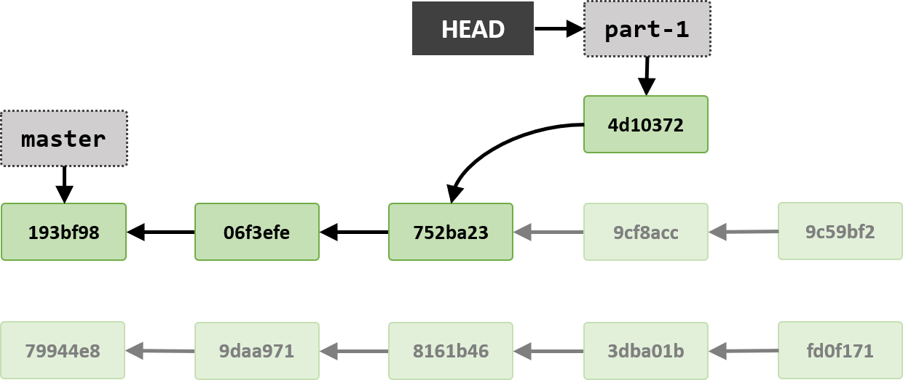
</p>

<a id="markdown-rebase-no-interactivo-simple" name="rebase-no-interactivo-simple"></a>
#### Rebase no interactivo simple

Algunos workflows (flujos de trabajo) con Git utilizan `git rebase` para mantener, en su mayoría, una historia lineal (véase por ejemplo [The Git Rebase Workflow](https://dev.to/shosta/the-git-rebase-workflow-2g49)). En el árbol de *Antes* vemos que un merge de `master` con cualquier otra rama resultaría en Git utilizando la estrategia recursiva; por otro lado, un merge de `master` con cualquier otra rama en *Después* utilizaría la estrategia fast-forward, manteniendo la historia lineal. Veamos cómo ir de *Antes* a *Después*.

<p align="center">
 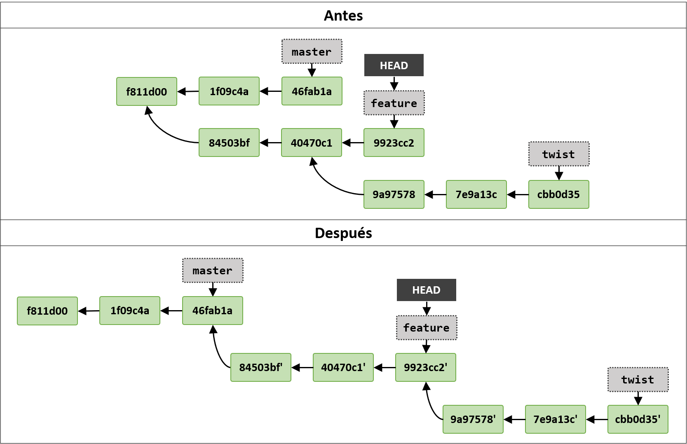
</p>

La tarea de reordenar el árbol se realiza con un rebase no interactivo. Antes de resolver el ejemplo, veamos con una imagen cómo funciona el comando `git rebase <nuevo-padre> [<rama>]`.

<p align="center">
 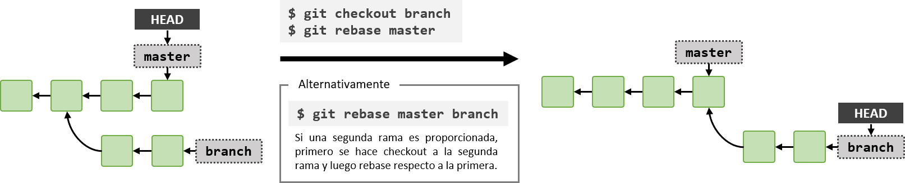
</p>

Ahora bien, para resolver el ejemplo, el primer paso es ejecutar un rebase de `feature` respecto a `master`. Para identificar qué commits de `feature` serán basados en `master` puede usar `git log <upstream>..<rama>`, que muestra los commits en `<rama>` que no son accesibles por `<upstream>`. En este caso sería `git log --oneline master..feature`.

```shell
$ git rebase master
First, rewinding head to replay your work on top of it...
Applying: Create foo.txt
Applying: Add data to foo.txt
Applying: Expand foo.txt
```

<p align="center">
 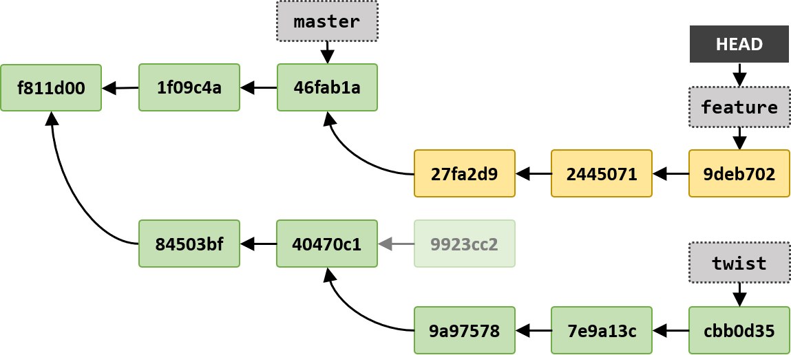
</p>

De amarillo vemos los commits nuevos resultantes del rebase. El rebase de la rama `feature` ha sido logrado sin más dificultad, pero vemos algo interesante en la rama `twist`: ahora tiene cinco commits propios en lugar de tres. Veamos qué ocurre al realizar el siguiente paso: un rebase de `twist` respecto a `feature`.

```shell
$ git rebase feature twist
First, rewinding head to replay your work on top of it...
Applying: Add more content to foo.txt
Using index info to reconstruct a base tree...
M       foo.txt
Falling back to patching base and 3-way merge...
Auto-merging foo.txt
CONFLICT (content): Merge conflict in foo.txt
error: Failed to merge in the changes.
hint: Use 'git am --show-current-patch' to see the failed patch
Patch failed at 0001 Add more content to foo.txt
Resolve all conflicts manually, mark them as resolved with
"git add/rm <conflicted_files>", then run "git rebase --continue".
You can instead skip this commit: run "git rebase --skip".
To abort and get back to the state before "git rebase", run "git rebase --abort".
```

En todo rebase existe el riesgo de tener conflictos, pero su proceso de solución es igual al de un conflicto de merge; basta con retirar los marcadores de conflicto, añadir los cambios al staging area y ejecutar `git rebase --continue`.

```shell
$ git add foo.txt

$ git rebase --continue
Applying: Add more content to foo.txt
Applying: Super Yikes to foo.txt
Using index info to reconstruct a base tree...
M       foo.txt
Falling back to patching base and 3-way merge...
Auto-merging foo.txt
Applying: Another line, another commit
Using index info to reconstruct a base tree...
M       foo.txt
Falling back to patching base and 3-way merge...
Auto-merging foo.txt
```

Los nuevos commits introducidos por el segundo rebase son mostrados en naranja. ¿Nota algo inesperado? Al realizar el rebase de `twist` a `master`, la rama `twist` tenía cinco commits sólo accesibles a través de ella, pero después del rebase, sólo existen tres. De alguna forma, después del rebase los commits duplicados fueron omitidos, ¡dejando el árbol de commits en el estado deseado!

<p align="center">
 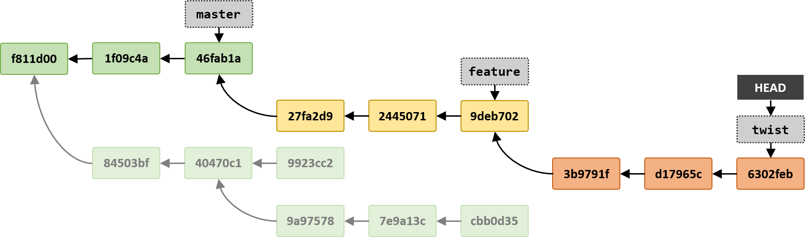
</p>

La respuesta a la muy conveniente omisión de commits duplicados puede encontrarse en la documentación oficial.

<p align="center">
 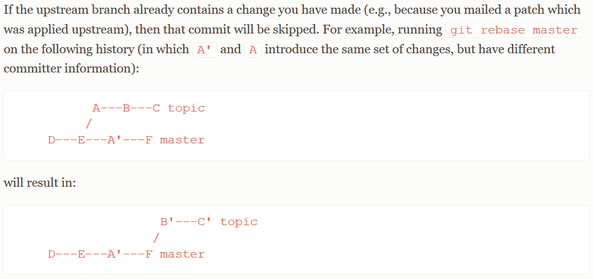
</p>

> Recuperado de <https://git-scm.com/docs/git-rebase>

<a id="markdown-rebase-no-interactivo-con---onto" name="rebase-no-interactivo-con---onto"></a>
#### Rebase no interactivo con `--onto`

Para algunos rebases, simplemente `git rebase <nuevo-padre> [<rama>]` no es suficiente.

Considere la siguiente transformación, donde el estado de _Antes_ es igual a donde nos quedamos en el ejemplo previo. Por claridad, he omitido los commits inaccesibles y he mantenido los colores.

<p align="center">
 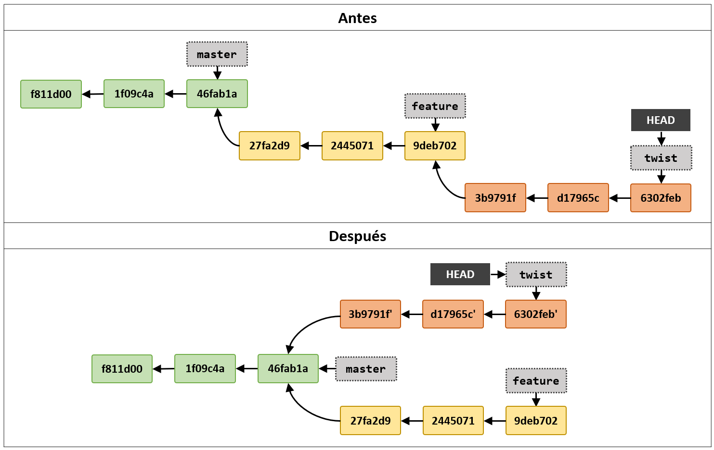
</p>

Entonces, ¿cómo se llega de _Antes_ a _Después_? Un primer intento consiste en ejecutar lo siguiente:

```shell
$ git rebase master
Current branch twist is up to date.
```

Estando en `twist`, el anterior comando debería, intuitivamente, dejarnos en el estado deseado, colocando los commits de `twist` directamente sobre `master`. Sin embargo, esto no ocurre.

El comando anterior indica que no existen modificaciones por realizar, y esto es correcto. 

Recuerde que un rebase mueve los commits que **no** son accesibles desde `<nuevo-padre>` pero sí desde la rama actual; en este caso, `<nuevo-padre>` es `master` y, la rama actual, `twist`. Veamos qué commits intentó mover `git rebase master` sobre la rama `master`:

```shell
$ git log --oneline master..twist
6302feb (HEAD -> twist) Add another line to twist.md
d17965c Add first line to twist.md
3b9791f Create twist.md file
9deb702 (feature) Add another line in feature.md
2445071 Add first line feature.md
27fa2d9 Create feature file
```

El log previo se lee así: "Muestra todos los commits que no son accesibles desde `master`, pero sí desde `twist`".

En relación con la ilustración de _Antes_, el log muestra, de arriba a abajo, los commits naranjas seguidos de los amarillos. Lo puede comprobar comparando los hashes.

<table>
  <tr>
    <td>
    Entonces, el comando <code>git rebase master</code> no realizó ningún cambio puesto que la secuencia de commits que hubiera movido ya se encuentra basada en <code>master</code>.
    </td>
  </tr>
</table>

Lo que se requiere es explícitamente seleccionar un **rango** de commits a mover, y no depender de la selección predefinida de `git rebase`. Justamente para estos casos de uso existe la bandera `--onto`.

Para obtener la transformación deseada de _Antes_ a _Después_, se ejecuta lo siguiente:

```shell
$ git rebase --onto master feature twist
Successfully rebased and updated refs/heads/twist.
```

El rebase previo se lee así: "Mueve todos los commits que no sean accesibles por `feature`, pero sí por `twist`, sobre `master`". Donde _mover_ significa crear una copia de la secuencia de commits, y asignar una base distinta a esta secuencia copiada. En este caso, la base era `feature`, ahora es `master`.

Re-enfatizo que Git **no elimina** los commits tras un rebase, sino que tan sólo crea una copia. Los commits antiguos ahora sólo son accesibles a través del `git reflog`.

La siguiente ilustración muestra el estado final del árbol, incluyendo los commits inaccesibles producidos en esta sección (he omitido los commits inaccesibles de la sección anterior [Rebase no interactivo simple](#rebase-no-interactivo-simple)):

<p align="center">
 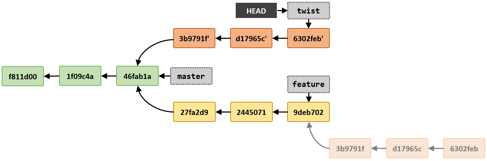
</p>

<a id="markdown-examinando-el-staging-area-working-tree-y-repositorio" name="examinando-el-staging-area-working-tree-y-repositorio"></a>
## Examinando el staging area, working tree y repositorio

Git ofrece comandos muy útiles para inspeccionar los contenidos de sus tres áreas; el working tree, staging area (index) y repositorio (directorio de Git). Esta sección pretende cubrirlos con casos de uso específicos.

<a id="markdown-inspección-del-staging-area-y-working-tree" name="inspección-del-staging-area-y-working-tree"></a>
### Inspección del staging area y working tree

[Documentación oficial de `git ls-files`](https://git-scm.com/docs/git-ls-files).

---

**Archivos ignorados untracked**

```bash
git ls-files --others --ignored --exclude-standard
```

**Archivos ignorados versionados**

```bash
git ls-files --ignored --exclude-standard
```

**Archivos untracked no ignorados**

```bash
git ls-files --others --exclude-standard
```

**Archivos untracked**

```bash
git ls-files --others
```

---

<a id="markdown-inspección-del-repositorio" name="inspección-del-repositorio"></a>
### Inspección del repositorio

Para la inspección de los contenidos del repositorio, existen dos comandos muy útiles:

Muestra los contenidos de un objeto tree. [Documentación oficial](https://git-scm.com/docs/git-ls-tree).

- (`<tree-ish>`) Referencia resoluble a un objeto tree. Por ejemplo, `HEAD`, un hash SHA-1 o una rama. En estos casos, el tree resuelto sería el snapshot del commit apuntado.
- (`-r`) También lista contenidos de sub-árboles. Es decir, muestra todos los nombres de archivo de todos los blobs directos e indirectos del árbol resuelto.
- (`--name-only`) No muestra datos extra como hashes y tipos de objetos, sólo lista los nombres de objeto (nombre de archivo).
- (`--abbrev[=<n>]`) Forma corta del hash de los objetos listados. Si `[=<n>]` se omite, la longitud es de 7 caracteres, de otra forma, de `n` caracteres.

```bnf
git ls-tree [-r] [--name-only] [--abbrev[=<n>]] <tree-ish>
```

Muestra los contenidos de un objeto de Git, incluyendo tags, commits, trees o blobs. Para inspeccionar trees, recomiendo el comando anterior. [Documentación oficial](https://git-scm.com/docs/git-show).

- (`<object>`) Referencia resoluble a un objeto (tag, commit, tree o blob).
- (`--oneline`) Versión corta de una sola línea.
- (`--name-status`) Muestra nombres y estados de archivos modificados.

```bnf
git show [--name-status] [--oneline] <object>
```

🔍 Los objetos de Git son explicados en Objetos de Git, en [Parte 1: Fundamentos](Parte1_Fundamentos.md).

---

**Archivos versionados por Git**

Archivos que existen en el repositorio de Git.

```bash
git ls-tree HEAD --name-only -r
```

**Resumen de cambios realizados por un commit**

Donde `<commit>` es cualquier referencia resoluble a un commit, p. ej.: `HEAD`.

```bash
git show <commit> --name-status --oneline
```

---

[👈 Parte 1: Fundamentos](Parte1_Fundamentos.md)
